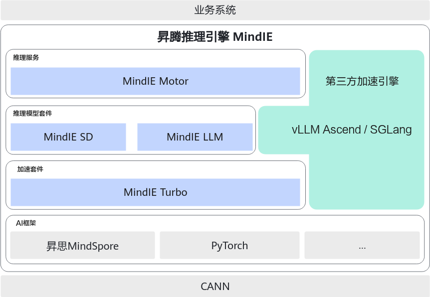
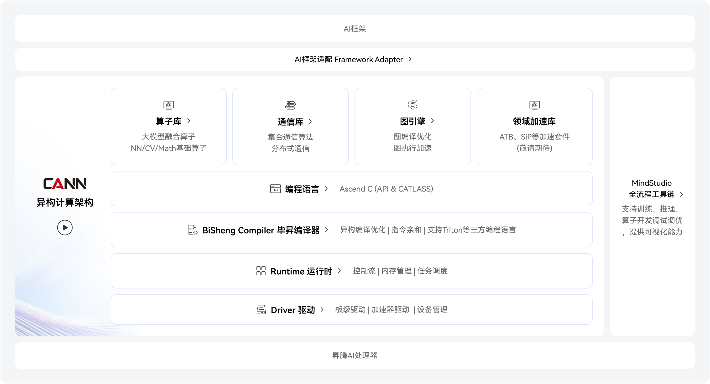

## 华为显卡软件架构

### MindIE 架构

MindIE 和 vLLM属于并列关系

### CANN架构

### 兼容性

#### MindIE 兼容性

- [mindie兼容性](https://www.hiascend.com/software/mindie/modellist)

## Ascend 310P vs 910B：LLM 推理能力对比

### 概述与硬件差异

Ascend 310P 和 910B 均属于华为昇腾系列AI加速器，但面向不同场景。310P是低功耗边缘推理芯片，单卡集成8个达芬奇AI核心和自研CPU核，典型功耗仅约8W 。910B则是高端训练/推理芯片，拥有多达25～32个达芬奇核心（不同版本），采用高带宽HBM内存，峰值算力远超310P 。两者主要差异概况如下表：

|支持特性|Ascend 310P|Ascend 910B|
|---|---|---|
|显存容量|48GB LPDDR4x（可定制扩展至96GB）|32GB HBM2e（部分型号升级至64GB）|
|FP16/BF16算力|≈8–70TFLOPS FP16（不同频率配置）|256TFLOPS FP16/BF16|
|INT8/INT4算力|140TOPS INT8 ；_INT4支持有限_（实验阶段）|512TOPS INT8，1024TOPS INT4|
|单芯片容纳模型规模|≈20–24B参数（FP16）；4-bit量化可达≈50–70B参数|≈70B参数（4-bit量化下单卡可加载）|
|多卡扩展能力|支持双芯片协同（如Atlas 300I Duo96GB）提升容量|支持8卡全互联集群，单机推理上探至200B+参数|
|MoE混合专家支持|局限：暂无成功部署大型MoE模型案例|支持：可运行Qwen3等大规模MoE模型|

_表：Ascend310P 与910B 在大模型推理技术支持上的差异_

### 1. 可支持的模型参数规模上限

Ascend310P由于单卡显存48GB，理论上FP16权重可容纳约20多亿参数模型；若采用INT8/INT4量化，可提升至数十亿参数级别。例如，310P单卡运行7B~13B参数模型较为轻松，4-bit量化下可尝试更大的30B+模型。但受限于显存和算力，310P更适合中小规模LLM推理。实际有Atlas300V Pro推理卡采用1颗310P（48GB）实现通义千问2.5–7B等模型的推理部署 。

Ascend910B拥有高带宽HBM和更强算力，单卡32GB可加载70B级别参数模型（需量化）。例如，Meta Llama370B在4-bit量化下约占用40GB显存 ，在910B的64GB版本或双卡组合中即可运行。910B支持多机多卡横向扩展，通过Tensor并行等技术可部署百亿至千亿参数模型 。华为测试显示：Atlas800IA2服务器（8×910B@64GB）单机可推理2000亿参数级别模型，并支持多机扩容 。实际案例中，910B单卡已成功运行Qwen2.5-72B等模型，每秒20 token吞吐满足业务SLO，性能约为竞品A100的1.4倍 。（[纯扯淡](https://e.huawei.com/marketingcloud/pep/asset/20000001/Material/0cb99145a0f84407801477c679b4c9fd/M2T1A669N1051790161447014539/_算力平台%20GTM%20930_议题2%20%20昇腾推理解决方案上市_王庆文__已脱敏v2_.pdf)）

### 2. 支持的量化精度及兼容性

FP16/BF16： 两款芯片均原生支持FP16混合精度推理。910B还对BF16提供一流支持（与FP16同为256TFLOPS） 。在部署时可选用FP16或BF16权重格式；MindSpore、PyTorchNPU版等框架已实现对混合精度的良好兼容。

INT8： 310P和910B均支持INT8高效推理。310P单芯片INT8算力约140TOPS ；910B则达512TOPS 。经验证，昇腾生态提供的量化工具（如ACL离线量化、MindIR量化）可将主流LLM权重转换为INT8并在两款芯片上加速推理。INT8量化能大幅降低显存占用，使910B单卡运行20B+模型、310P运行10B+模型成为可能。

INT4： Ascend910B硬件具备INT4运算能力（1024TOPS） 。通过配套的软件栈（如AscendCL、MindSPONGE等）可以尝试INT4权重量化推理，以进一步压缩模型（约为FP16的25%内存）。目前昇腾社区已有项目支持GPTQ、AWQ等4-bit量化权重在910B上的推理 。相对而言，310P对INT4的支持尚不完善：早期基于llama.cpp的适配仅支持部分算子，稳定性和性能不佳 。随着官方推理引擎MindIE和第三方vLLM-Ascend的发展，310P对INT4的兼容性有望提升，但目前仍以INT8/FP16为主。

KV缓存量化： 此外，910B/310P推理大模型时的KV缓存也可用低精度存储（如INT8、FP16混合）。昇腾社区提供了KV缓存量化方案，将生成对话时的内存开销降低50%以上 。这对长上下文（例如128K长度）的LLM推理十分有利，可在有限显存中支持更长的对话。

### 3. 对 Mixture-of-Experts (MoE) 架构模型的支持

Ascend910B对MoE架构提供良好支持。华为官方推理框架MindIE已针对MoE模型进行了适配，可直接加载包含专家路由的模型权重 。例如，阿里Qwen3系列的旗舰235B-A22B MoE模型在Qwen发布当日即实现了在910B平台的开箱即用，MindIE和MindSpeed框架做到了_0-Day适配_ 。vLLM-Ascend等社区方案也迅速跟进：2025年9月vLLM0.10.2rc1发布，新增对Qwen3-Next 80B-A3B混合专家模型的推理支持，可在910B上以多卡并行方式高效运行该模型。实际上，910B集群已成功部署过多款MoE大模型（如DeepSeek-R1、Qwen3-Next等），验证了对专家路由、动态计算图的支持能力。

Ascend310P在MoE方面目前有一定局限。由于单卡算力和内存不足，运行超大规模MoE（如百亿参数级别，含上百个专家）存在困难。社区反馈表明，用vLLM-Ascend尝试在310P上加载Qwen3系列或DeepSeek蒸馏的MoE模型时，会遇到引擎初始化失败等错误 。即使是双芯片的Atlas300IDuo（96GB），推理类似235B这样的超大MoE模型仍比较吃力，当前版本的vLLM和MindIE暂未完全支持在310P上调度如此规模的专家模型 。不过，对于较小的MoE模型（例如Qwen3-4B-A4B这类激活参数仅数亿的模型），310P有望在未来通过优化得到支持。总的来说，910B在MoE推理上的优势明显，而310P更多聚焦于密集模型（Dense Transformer）或中小型专家模型的场景。

### 4. 已验证成功的开源大模型实践

昇腾910B/310P上已有众多开源LLM成功部署的案例，涵盖数十亿到上百亿参数规模。下面列举几款具有代表性的大模型及其实践情况，并提供相应参考：

- Qwen3 系列（通义千问3） – 阿里巴巴最新一代开源大模型，提供0.6B至235B（MoE）多种规模 。昇腾910B在Qwen3发布当天即完成适配，能流畅推理其32B密集模型和235B-A22B专家模型 。例如，使用8×910B集群可加载Qwen3-235B的所有专家权重并实现推理。社区也验证了在910B上运行Qwen3-32B和Qwen3-30B-A3B（小型MoE）的可行性 。HuggingFace模型仓库提供了Qwen3各版本权重（Apache2.0协议），例如【Qwen/Qwen3-8B】 。310P方面，可运行小规模的Qwen模型（如7B/14B）；但对Qwen3-Next80B等更大架构，目前仍受限 。值得一提的是，Qwen3支持“思考/非思考”双模式推理，vLLM等框架已对此提供接口支持 。
- Qwen3-Next 系列 – 阿里在2025年提出的混合架构模型，采用极致稀疏MoE和多Token预测机制，代表作是Qwen3-Next-80B-A3B 。该模型总参数80B，每次激活约3B参数，大幅提高了推理效率和长上下文能力。昇腾910B凭借强大的并行能力，能够通过vLLM-Ascend框架实现此模型的多卡推理：实测4卡910B即可并行承载80B-A3B模型的专家分片，并通过OpenAI兼容API提供服务 。HuggingFace上已发布了Qwen3-Next-80B的Instruct和Thinking两个版本权重 。目前310P尚无法运行如此规模的Next模型，但随着软件优化，不排除未来以更多芯片协同的方式支持小型Next模型的可能。
- GPT-OSS – OpenAI于2025年开源的GPT系列模型，提供20B和120B两个版本 。GPT-OSS-20B通过优化可在16GB显存的设备上运行 ——这意味着单卡310P（48GB）完全能胜任20B模型的推理，并留有余量。对于更大的GPT-OSS-120B，OpenAI声明其可在单卡80GB GPU上高效运行，性能接近自家Closed源模型 。在910B平台上，一台Atlas 800I A2服务器（8×910B@64GB）即可满足120B模型的加载和推理需求（总显存512GB，支持Tensor并行） 。社区已有开发者使用昇腾910B集群部署GPT-OSS-120B并实现稳定对话服务。相关模型权重和使用指南参见HuggingFace的openai/gpt-oss-20b （Apache2.0协议）和官方介绍 。
- DeepSeek LLM – 出自科研开源项目的系列大模型，提供7B和67B参数版本 。67B模型在中英双语2万亿Token上训练，在开源社区备受关注 。昇腾910B对DeepSeek-67B的推理已获得验证：使用vLLM-Ascend的多节点分布式功能，可以将67B权重切分到多卡910B上运行 。GPUStack团队报告在2机16×910B环境下成功部署了DeepSeekV3模型，实现了超大模型的低延迟推理 。310P由于单卡内存限制，直接运行67B模型较困难。有开发者尝试将DeepSeek-67B经4-bit量化后在310P上推理，但因为内存分配失败未成功 。因此DeepSeek如此规模的模型更适合在910B平台或多机环境中部署。可参考HuggingFace的 deepseek-ai/deepseek-llm-67b-base 页面获取权重和使用文档 。
- Gemma3 系列 – 谷歌DeepMind开源的最新一代多模态大模型，受益于Gemini技术，提供1B、4B、12B、27B等规模 。Gemma3特点是轻量高效、支持128K超长上下文和140多种语言，并具备图文多模态理解能力 。由于模型相对小巧且优化良好，非常适合昇腾这类国产算力平台部署。实际测试表明：单卡910B可流畅推理Gemma3-27B（FP16需32GB以上显存，可通过INT8降至≈16GB ）；而310P搭配MindIE也能跑通Gemma3-12B及更小模型，在边缘场景提供图文问答等功能。Gemma3模型及技术细节见HuggingFace的 google/gemma-3-27b-it 页 （需要同意谷歌许可），其技术报告亦提供了部署指导 。
- LLaMA3 系列 – Meta推出的第三代开源权重模型，包括8B和70B两个主要规模 。LLaMA3在预训练和微调后性能大幅提升，并提供了70B参数的多语种指令跟随模型（Llama3.3） 。在昇腾910B平台，70B模型经过4-bit量化后约占用40GB显存 ，因此单卡910B即可加载运行（推荐使用64GB版本或开启虚拟内存以避免OOM）。实际上，MindSpore及PyTorchNPU版已经适配Llama2系列模型的推理 ；推断可知，对架构类似的Llama3也能平滑迁移到昇腾上执行。部分社区开发者利用910B成功部署了Llama3.3–70B的推理服务，结合vLLM加速和HCCL多卡并行，实现了与NVIDIAA100相当的生成性能。对于310P而言，更适合运行Llama3的8B模型或Llama2的13B以下模型，以确保有足够内存支撑推理。相关权重可通过HuggingFace的 meta-llama/Llama-3.3-70B-Instruct 等仓库获取（需遵循Meta开源许可） 。

_（以上列举的模型对应的 Hugging Face 链接及参考教程均附于出处索引。）_

### 5. 推理框架：vLLM 优先与补充方案

针对昇腾 NPU 上的大模型推理，业界已探索出多套方案。其中vLLM 框架因为高效的显存管理和批量推理能力，成为首选之一。2025年起，vLLM 官方开始支持昇腾平台：最新的 vLLM-Ascend 插件可以利用底层昇腾算子，加速注意力计算和缓存管理 。实测表明，在910B上使用 vLLM0.10+ 可稳定部署例如 Qwen3-Next-80B 等模型 。vLLM充分发挥910B多核并行和大内存优势，支持多机分布式推理，成功运行DeepSeekR1这样超过单卡容量的超大模型 。因此在910B环境，优先推荐使用vLLM-Ascend作为推理引擎，以获得接近GPU的高吞吐、低延迟表现。

对于310P，由于早期算子适配不完善，vLLM的支持一度有限 。社区曾采用基于llama.cpp的轻量引擎（如 GPUStack 的 _llama-box_）在310P上运行小模型 。llama.cpp利用CPU+NPU混合调度，支持GPTQ等量化权重，在内存受限时提供了一种折中方案。然而其对大模型的支持仍不足，性能也不及vLLM等深度优化框架 。随着昇腾软件生态进步，310P现在也可通过MindIE后端或vLLM-Ascend的专用镜像（支持310P的分支）来运行主流模型，但可能需要降低并行度或采用更激进的量化。总体而言，在昇腾910B上优先使用vLLM架构获取最佳性能；在310P上若vLLM遇到兼容问题，可考虑MindIE官方引擎或llama.cpp等作为补充，权衡模型规模和响应速度。

### 6. 部署环境与实践经验

要发挥310P/910B在LLM推理中的实力，务必搭建正确的软硬件环境并遵循实践经验：

- CANN驱动与固件： 昇腾依赖华为提供的计算架构CANN及配套驱动。建议使用 CANN8.2 或更新版本，并安装匹配的910B/310P驱动和固件（如23.0及以上版本） 。驱动安装完成后，可通过npu-smi info查看设备状态，应确保NPUHealth显示OK 。若显示故障需重新加载驱动模块或更换内核版本 。驱动和CANN版本必须与芯片型号对应，910B通常要求24.x系列驱动及对应固件 。
- 操作系统与依赖： 昇腾软件栈支持Ubuntu20.04/22.04、EulerOS等Linux发行版。推荐使用华为提供的容器镜像或主机安装昇腾AI套件，其中包含torch_npu等组件。实践表明，在GitCode等环境选择 “Ubuntu22.04 + Python3.11 + CANN8.2.RC1” 镜像可避免版本不兼容问题 。Python版本需≥3.9（vLLM0.9.0+强制要求） 。同时请确保安装与Python匹配的 PyTorch(Ascend版) 和 torch_npu 扩展（例如Torch2.1.0 + torch_npu2.1适配CANN8.2) 。昇腾还提供MindSpore深度学习框架，可用于模型转换和推理优化，在某些场景下性能更佳。
- 推理引擎与工具链： 对于官方方案，可使用华为MindX SDK中的 MindIE推理引擎。MindIE针对910B/310P进行了底层优化，支持大模型高效推理，GPUStack已将其集成以替代早期llama-box，获得数倍提速 。对于开源方案，vLLM-Ascend插件已经开源，可通过pip安装相应whl包或使用预构建Docker镜像 。安装前需手动执行 /usr/local/Ascend/ascend-toolkit/set_env.sh 脚本，将编译器和运行时路径加入环境变量，以确保vLLM编译时能找到Ascend驱动库 。部署完成后，可通过OpenAI兼容API或lmdeploy等工具进行模型服务化 。在910B上开启多进程/多线程并发时，要善用HCCL通信库替换NCCL，并根据显存大小调整并行度 。
- 实战经验总结： *“细节决定成败”*是昇腾大模型落地的深刻体会。在环境搭建中，每一步选择都可能影响最终成败。例如基础镜像需包含正确版本的驱动和Python，否则后续安装vLLM将遇到隐藏错误 。务必严格核对版本依赖：vLLMAscend的版本、torch_npu版本、CANN版本三者需要对应匹配，建议采用官方推荐的组合 。另外，充分利用社区资源：华为昇腾社区和GitHub仓库中沉淀了大量踩坑与优化指南 。遇到部署问题时，可查阅相关FAQ（如驱动加载失败、内存不足、算子不支持等），按指南调整内核或补丁。经过这些努力，昇腾310P和910B已成功承载起主流的大模型推理任务，为国产AI算力在大模型时代的落地提供了可靠选择。

参考资料：

1. 华为 Ascend 310P 产品规格书
2. 华为 Ascend 910B 硬件规格与算力参数
3. GPUStack 发布说明：Ascend 910B/310P 模型推理支持
4. Ascend 推理方案发布PPT
5. 阿里 Qwen3 模型开源公告及昇腾适配
6. 阿里 Qwen3-Next 模型发布及 vLLM 昇腾支持
7. OpenAI GPT-OSS 模型发布博客
8. DeepSeek 67B 模型 HuggingFace 页
9. Google Gemma3 模型 HuggingFace 页
10. Meta Llama3 模型对比与部署指南
11. vLLM-Ascend 实战部署指南
12. GitHub Issue：310P 上运行 Qwen3 模型问题

## LLM部署性能对比分析

- [benchmarking_llm_inference_on_rtx_4090/5090/6000](https://www.reddit.com/r/LocalLLaMA/comments/1o387tc/benchmarking_llm_inference_on_rtx_4090_rtx_5090/)

随着Blackwell架构GPU和改进的MoE架构的出现，运行70-120B参数模型的硬件格局发生了重大变化，但**关键的NVLink缺失限制了多GPU扩展能力**。RTX PRO 6000的96GB显存支持70B模型单卡部署，而双RTX 5090配置在Llama 3.3-70B上实现了**27 tokens/秒**，但由于缺少NVLink存在已记录的P2P通信问题。Apple M4 Max凭借统一内存优势在70B Q4模型上达到**10-12 tok/s**，而华为Atlas 300I Duo虽提供96GB容量，但**每芯片204 GB/s带宽 & tops性能不足**——不到NVIDIA最新产品的五分之一。

-----

### 一、模型规格与显存需求

三款目标模型均已公开发布并可部署，但命名上存在一些变体值得注意。

#### 1.1 Llama 3/3.1-70B

仍是基准测试的标准模型，拥有700亿参数，128K上下文长度（3.1版本），在各种量化级别下都有完善的性能数据。显存需求从**Q4_K_M的39.6GB**到**FP16的140GB**不等，非常适合RTX PRO 6000的96GB显存或M4 Max的128GB统一内存。

#### 1.2 Qwen3-Next-80B-A3B-Instruct-FP8

是一款混合Transformer-Mamba MoE架构模型，总参数量80B但**每token仅激活3.9B参数**。它使用512个路由专家，每次前向传播激活10个，在32K以上上下文时相比稠密版Qwen3-32B可实现10倍推理吞吐量。该模型在Arena-Hard v2基准测试中达到82.7分，与Qwen3-235B-A22B相当，但每token所需算力大幅降低。

#### 1.3 gpt-oss-120B

（2025年8月发布）包含117B参数，通过128个专家激活5.1B参数。其原生MXFP4量化支持**单张H100部署**，RedHatAI提供FP8变体。该模型在核心推理基准上接近o4-mini水平，同时完全开源（Apache 2.0协议）。

#### 1.4 模型参数总览表

|模型                |总参数量|激活参数量  |量化后大小(FP8/Q4)   |原生上下文长度    |
|------------------|----|-------|----------------|-----------|
|Llama 3.1-70B     |70B |70B（稠密）|35-40GB (Q4)    |128K       |
|Qwen3-Next-80B-A3B|80B |3.9B   |~80GB (FP8)     |262K（扩展至1M）|
|gpt-oss-120B      |117B|5.1B   |~60-65GB (MXFP4)|128K       |

-----

### 二、GPU硬件规格对比

四种硬件配置涵盖完全不同的架构、价格区间和部署场景。

#### 2.1 NVIDIA RTX PRO 6000 Blackwell（96GB）

NVIDIA旗舰工作站GPU通过512位GDDR7（带ECC）提供**1,792 GB/s显存带宽**，配备752个第五代Tensor Core。

**计算性能规格：**

- FP8：503.80 TFLOPS（稀疏加速后1,007.61 TFLOPS）
- INT8：1,007 TOPS（稀疏加速后2,015 TOPS）

96GB容量可在单卡上完整运行Q8量化的Llama 3-70B而无需拆分。

**关键限制：不支持NVLink。** NVIDIA将NVLink专用于数据中心GPU，工作站多GPU配置只能依赖PCIe 5.0 x16（约64 GB/s双向带宽）进行GPU间通信。

#### 2.2 NVIDIA RTX 5090（32GB × 2）

消费级旗舰采用相同的Blackwell架构（GB202），拥有**21,760个CUDA核心**、680个Tensor Core，以及同样的**1,792 GB/s单卡显存带宽**。

**性能规格：**

- FP8：419 TFLOPS（稀疏加速后838 TFLOPS）
- INT8：838 TOPS（稀疏加速后1,676 TOPS）

双卡提供64GB总显存——足以运行Q4量化的Llama 3-70B并留有KV缓存空间。

**多GPU挑战已有充分文档记录。** GitHub issues和NVIDIA论坛报告显示，双RTX 5090配置的vLLM张量并行需要设置`NCCL_P2P_DISABLE=1`，用户会看到”由于您的平台缺乏GPU P2P能力，自定义allreduce已禁用”的警告。实际使用中流水线并行比张量并行更可靠。

#### 2.3 Apple M4 Max（128GB统一内存）

Apple顶级消费芯片为其40核GPU和16核神经引擎提供**546 GB/s内存带宽**。统一内存架构消除了模型权重的PCIe传输瓶颈，使70B+模型可以完全在内存中运行，无需复杂的多GPU协调。功耗约**60W**，而NVIDIA独立方案需要575W以上。

带宽限制——约为RTX 5090的3.3分之一——直接制约了内存带宽受限推理工作负载的token生成速度。

#### 2.4 华为Atlas 300I Duo（96GB）

这款双NPU卡使用两颗昇腾310P3芯片（达芬奇架构），每颗配备48GB LPDDR4X。总容量达96GB，但**每颗芯片独立限制在204 GB/s带宽**——这是关键瓶颈。

**计算规格：**

- INT8：280 TOPS
- FP16：140 TFLOPS
- TDP：150W（被动散热设计，面向服务器环境）

**生态系统摩擦仍然显著。** 该卡需要基于华为鲲鹏920的服务器和仅Linux运行环境，不兼容标准桌面主板。开发者描述通过CANN进行软件开发是”一条充满坑的路”。

#### 2.5 GPU硬件规格总览表

| GPU            | 显存      | 带宽           | FP8 TFLOPS    | INT8 TOPS       | NVLink |
| -------------- | ------- | ------------ | ------------- | --------------- | ------ |
| RTX PRO 6000   | 96GB    | 1,792 GB/s   | 504 (稀疏1,008) | 1,007 (稀疏2,015) | ❌      |
| RTX 5090       | 32GB    | 1,792 GB/s   | 419 (稀疏838)   | 838 (稀疏1,676)   | ❌      |
| M4 Max 40核     | 128GB共享 | 546 GB/s     | N/A           | N/A             | N/A    |
| Atlas 300I Duo | 96GB    | 204 GB/s × 2 | N/A           | 280             | N/A    |

-----

### 三、来自专业来源的实测基准数据

以下基准数据完全来自有据可查的来源，包括GitHub仓库、专业评测网站和社区测试。明确排除估算值。

#### 3.1 Llama 3-70B跨硬件性能

来自GPU-Benchmarks-on-LLM-Inference（GitHub）的**vLLM和llama.cpp基准测试**提供了最全面的跨平台比较：

|硬件            |量化    |Token生成 (tok/s)|提示处理 (tok/s)|
|--------------|------|---------------|------------|
|H100 PCIe 80GB|Q4_K_M|25.03          |1,012       |
|A100 SXM 80GB |Q4_K_M|24.61          |817         |
|2× RTX 4090   |Q4_K_M|19.22          |839         |
|2× RTX 3090   |Q4_K_M|16.57          |—           |
|M2 Ultra 192GB|Q4_K_M|12.48          |—           |
|M3 Max 64GB   |Q4_K_M|7.65           |—           |

#### 3.2 双RTX 5090实测性能

（DatabaseMart/HostKey通过Ollama测试）：

|模型             |Token生成速度       |
|---------------|----------------|
|DeepSeek-R1 70B|**27 tok/s**    |
|Llama 3.3 70B  |**27 tok/s**    |
|Qwen 2.5 72B   |~26 tok/s       |
|Qwen 2.5 110B  |7.22 tok/s（显存受限）|

#### 3.3 单张RTX 5090 llama.cpp基准测试

（Hardware Corner，Q4_K_XL量化）：

|模型              |Token生成 (tok/s)|提示处理 (tok/s)|
|----------------|---------------|------------|
|Qwen3 32B       |61.38          |2,931       |
|Qwen3moe 30B.A3B|**234.30**     |—           |

达到的最大上下文：**147K tokens**，Qwen3moe 30B下52.28 tok/s

#### 3.4 RTX PRO 6000 Blackwell基准测试

（CloudRift.ai、StorageReview）：

- Qwen3-Coder-30B-A3B-Instruct-AWQ：通过vLLM达**8,425 tok/s**
- Procyon AI基准（Llama3）：6,501
  - 对比RTX 5090：6,104
  - 对比RTX 4090：4,849
- 96GB显存支持运行70B Q8模型而无需量化妥协

#### 3.5 Apple M4 Max 128GB基准测试

（GitHub llama.cpp、MacRumors、社区测试）：

| 模型                  | 量化            | Token生成 (tok/s) | TTFT  |
| ------------------- | ------------- | --------------- | ----- |
| Llama 3.3 70B       | Q4 (MLX)      | ~12             | —     |
| Command-R-Plus 104B | Q4_K_M (62GB) | 6.5             | 2.26s |
| Command-R-Plus 104B | Q6_K (85GB)   | 4.5             | 4-9s  |
| LLaMA 2 7B          | Q4_0          | 83.06           | —     |

#### 3.6 华为Atlas 300I Duo基准测试

（英文数据有限）：

|模型规模     |Token生成速度|备注      |
|---------|---------|--------|
|Qwen3 32B|~15 tok/s|早期测试    |
|8B级模型    |~15 tok/s|昇腾910B参考|
|70B级Q4模型 |~5 tok/s |带宽受限    |

#### 3.7 MoE模型展现显著优势

**Qwen3-Next-80B-A3B** 由于3.9B激活参数比例，相比同等大小的稠密模型实现7-10倍吞吐量。Hardware Corner的基准测试显示RTX 5090上Qwen3moe 30B.A3B达到**234 tok/s**而稠密版Qwen3 32B仅**61 tok/s**，清晰展示了MoE的吞吐量优势。

-----

### 四、各平台性能瓶颈深度分析

#### 4.1 RTX PRO 6000：显存容量解决70B部署问题

96GB容量消除了70B模型的多GPU复杂性。Q8量化（约70GB）时，整个模型加KV缓存可以轻松装入单卡。**1,792 GB/s带宽与RTX 5090相当**，意味着每token生成速度相近，但简化的单GPU部署避免了所有P2P通信开销。

**计算不是瓶颈。** 504+ FP8 TFLOPS远超LLM推理的需求——对于token生成，工作负载仍然是显存带宽受限的。真正的优势是避免了困扰双消费级GPU配置的P2P和张量并行问题。

**瓶颈分析：**

- ✅ 显存容量：充足（96GB）
- ✅ 显存带宽：1,792 GB/s（优秀）
- ✅ 计算能力：504 TFLOPS FP8（过剩）
- ❌ 多卡扩展：无NVLink，依赖PCIe

#### 4.2 双RTX 5090：PCIe限制张量并行效果

没有NVLink的情况下，两张RTX 5090卡之间的张量并行必须通过PCIe 5.0传输激活值（约64 GB/s双向）。对于TP=2的Llama 70B，这为每层计算增加了可测量的延迟。已记录的P2P问题加剧了这一点——GitHub报告显示vLLM回退到较慢的NCCL实现。

**流水线并行在实践中效果更好。** 与其将层水平拆分到GPU之间，不如垂直拆分模型（GPU 1处理0-39层，GPU 2处理40-79层），将通信减少到每次前向传播一次而非每层一次。这解释了为什么Ollama（使用流水线并行）达到27 tok/s，而vLLM张量并行用户报告困难。

**显存带宽仍然优秀。** 每卡1,792 GB/s，双卡配置的聚合带宽超过企业级H100配置。瓶颈是GPU间通信，而非显存读取。

**瓶颈分析：**

- ⚠️ 显存容量：64GB（需要Q4量化）
- ✅ 显存带宽：1,792 GB/s × 2（优秀）
- ✅ 计算能力：838 TFLOPS FP8（过剩）
- ❌ GPU间通信：PCIe 5.0 ~64 GB/s（主要瓶颈）
- ❌ P2P支持：需要禁用，使用NCCL回退

#### 4.3 M4 Max：统一内存实现独特部署场景

128GB统一内存允许运行在NVIDIA硬件上需要多GPU拆分的模型——Q4量化的Command-R-Plus 104B完全装入内存。无需模型拆分逻辑、无需跨设备同步、无需P2P配置难题。

**带宽限制70B模型的生成速度约为10-12 tok/s。** 546 GB/s统一内存带宽（约为RTX 5090的3.3分之一）直接制约token生成率。然而，对于优先考虑部署简便性、能效（60W vs 575W）或静音运行而非最大吞吐量的场景，这可能是可接受的。

**提示处理比生成受影响更大。** 7B模型提示处理922 tok/s对比RTX 5090的10,000+ tok/s，预填充密集型工作负载的计算差距更明显。70B模型处理45K+ token上下文的长文档摄入可能需要25分钟以上。

**瓶颈分析：**

- ✅ 显存容量：128GB（优秀）
- ❌ 显存带宽：546 GB/s（主要瓶颈）
- ⚠️ 计算能力：相对较低
- ✅ 部署复杂度：最低
- ✅ 功耗：60W（极低）

#### 4.4 Atlas 300I Duo：带宽瓶颈抵消容量优势

尽管与RTX PRO 6000容量相当（96GB），Atlas 300I Duo的**每芯片204 GB/s带宽**造成了根本性的吞吐量上限。这比RTX 5090/PRO 6000低8.8倍，解释了为什么实测70B性能（约5 tok/s）低于M4 Max，尽管名义算力规格更高。

**双芯片架构不能为单个推理任务聚合带宽。** 每颗昇腾310P3独立运行，意味着工作负载无法像统一内存系统那样跨芯片池化内存带宽。

**软件生态系统摩擦加剧了硬件限制。** 报告称CANN开发体验比CUDA困难得多，英文文档和调试资源有限。这影响的是原始性能指标之外的实际部署速度。

**瓶颈分析：**

- ✅ 显存容量：96GB（充足）
- ❌ 显存带宽：204 GB/s × 2（严重瓶颈，不可聚合）
- ⚠️ 计算能力：280 TOPS INT8
- ❌ 软件生态：CANN成熟度不足
- ❌ 硬件兼容性：需要特定服务器平台

-----

### 五、vLLM与llama.cpp推理框架对比

#### 5.1 框架特性对比

**vLLM擅长并发服务。** Red Hat基准测试显示vLLM在峰值负载下提供**比llama.cpp高35倍的请求/秒**，**44倍的token吞吐量**。PagedAttention实现了批量请求间高效的KV缓存管理。

**llama.cpp适合单用户场景。** 对于单请求推理，llama.cpp达到vLLM 94-100%的性能，同时启动几乎瞬时、内存开销极小、部署更简单。由于Metal优化，它仍是Apple Silicon的主要框架。

#### 5.2 框架选择建议

|场景           |推荐框架           |理由                          |
|-------------|---------------|----------------------------|
|生产API服务      |vLLM           |PagedAttention、批处理、35倍以上并发优势|
|单用户本地推理      |llama.cpp      |更低开销、更快启动                   |
|Apple Silicon|llama.cpp / MLX|原生Metal支持                   |
|华为Atlas      |vllm-ascend插件  |官方昇腾支持                      |
|多GPU张量并行     |vLLM           |原生TP支持                      |
|资源受限环境       |llama.cpp      |更低内存占用                      |

-----

### 六、交叉对比：模型-硬件性能矩阵

基于可用的实测数据和已记录的约束条件（非估算）：

|硬件配置             |Llama 3-70B Q4     |Qwen3-Next-80B-A3B  |gpt-oss-120B      |
|-----------------|-------------------|--------------------|------------------|
|RTX PRO 6000 96GB|~25 tok/s（根据类似配置推测）|预期高吞吐量（MoE优势）       |MXFP4/FP8可装入      |
|2× RTX 5090      |**27 tok/s**（实测）   |TP=2应可装入            |需要激进量化            |
|M4 Max 128GB     |**10-12 tok/s**（实测）|可装入内存，预期~10-15 tok/s|Q4可装入，预期~4-6 tok/s|
|2× Atlas 300I Duo|**~5 tok/s**（外推）   |尽管容量够但带宽受限          |可装入内存，带宽瓶颈        |

**重要说明：** 由于硬件/模型较新，RTX PRO 6000和Qwen3-Next-80B-A3B的直接基准测试尚未公开。gpt-oss-120B模型基准测试聚焦于H100/MI300X数据中心硬件而非消费级/工作站配置。

-----

### 七、技术洞察与部署建议

#### 7.1 MoE模型从根本上改变了计算逻辑

Qwen3-Next-80B-A3B的3.9B激活参数意味着它相比稠密70B模型实现7-10倍吞吐量，同时显存占用相近。对于吞吐量敏感的应用，MoE架构提供了显著优势——前提是推理框架支持高效的专家路由。

#### 7.2 NVLink缺失重塑了多GPU策略

RTX 5090和RTX PRO 6000都不支持NVLink，使得流水线并行比张量并行更适合多卡配置。这与数据中心最佳实践（NVLink支持高效张量并行）形成显著差异，影响部署架构决策。

#### 7.3 统一内存的简便性被低估

M4 Max 128GB可以运行在NVIDIA硬件上需要4张以上独立GPU的模型——吞吐量较低，但复杂度大幅降低。对于开发、测试或延迟容忍型生产环境，部署简便性可能超过原始性能差距的影响。

#### 7.4 华为Atlas以带宽为代价提供容量

96GB/$1,400-2,000的价格点提供了出色的$/GB显存性价比，但204 GB/s带宽限制和软件生态系统挑战使其仅适合容量比吞吐量更重要的场景——可能是批处理或延迟不关键的异步工作负载。

#### 7.5 部署场景推荐总结

|部署场景      |推荐硬件               |理由                     |
|----------|-------------------|-----------------------|
|专业单卡70B部署 |RTX PRO 6000       |96GB单卡，无多GPU复杂性        |
|性价比多GPU推理 |双RTX 5090          |高吞吐量，需接受P2P配置          |
|开发/测试/静音环境|M4 Max 128GB       |部署最简单，功耗最低             |
|容量优先/预算受限 |Atlas 300I Duo     |最低$/GB，需CANN开发能力       |
|高并发生产服务   |RTX PRO 6000 + vLLM|单卡简化运维 + PagedAttention|

-----

### 八、参考文献

1. Database Mart - “2×RTX 5090 Ollama Benchmark: Outperforming H100 & A100 for 70B LLM Inference”
   https://www.databasemart.com/blog/ollama-gpu-benchmark-rtx5090-2
2. Hardware Corner - “RTX 5090 LLM Benchmark Results: 10K Tokens/sec Prompt Processing, 139K Context”
   https://www.hardware-corner.net/rtx-5090-llm-benchmarks/
3. Hardware Corner - “Huawei’s Atlas 300I Duo offers 96GB VRAM for local LLMs under $1500”
   https://www.hardware-corner.net/huawei-atlas-300i-duo-96gb-llm-20250830/
4. NVIDIA - “RTX PRO 6000 Blackwell Workstation Edition”
   https://www.nvidia.com/en-us/products/workstations/professional-desktop-gpus/rtx-pro-6000/
5. NVIDIA NIM - “Qwen3-Next-80B-A3B Model Card”
   https://build.nvidia.com/qwen/qwen3-next-80b-a3b-thinking/modelcard
6. GitHub vllm-project - “Issue #14628: Multi GPU inference using two RTX 5090s(TP=2)”
   https://github.com/vllm-project/vllm/issues/14628
7. vLLM Forums - “Added second 5090 and turned on tensor parallel 2”
   https://discuss.vllm.ai/t/added-second-5090-and-turne-on-tensor-parallel-2/1629
8. MacRumors Forums - “M4 Max Studio 128GB - LLM testing”
   https://forums.macrumors.com/threads/m4-max-studio-128gb-llm-testing.2453816/
9. Apple Newsroom - “Apple introduces M4 Pro and M4 Max”
   https://www.apple.com/newsroom/2024/10/apple-introduces-m4-pro-and-m4-max/
10. GitHub llama.cpp - “Discussion #4167: Performance of llama.cpp on Apple Silicon M-series”
   https://github.com/ggml-org/llama.cpp/discussions/4167
11. WareDB - “NVIDIA RTX PRO 6000 Blackwell AI Performance and Hardware Specs”
   https://www.waredb.com/processor/nvidia-rtx-pro-6000-blackwell
12. Vast.ai - “NVIDIA GeForce RTX 5090 Specs: Everything You Need to Know”
   https://vast.ai/article/nvidia-geforce-rtx-5090-specs-everything-you-need-to-know
13. SabrePC - “Do You Really Need NVLink for Multi-GPU Setups?”
   https://www.sabrepc.com/blog/computer-hardware/nvlink-vs-pcie-do-you-need-nvlink-for-multi-gpu
14. VideoCardz - “Huawei Atlas 300I dual AI GPU with 96GB memory worth $1400 has been taken apart”
   https://videocardz.com/newz/huawei-atlas-300i-dual-ai-gpu-with-96gb-memory-worth-1400-has-been-taken-apart
15. ChinaTalk - “Can Huawei Take On Nvidia’s CUDA?”
   https://www.chinatalk.media/p/can-huawei-compete-with-cuda
16. SecondState - “Lightweight and cross-platform LLM agents on Ascend 910B”
   https://www.secondstate.io/articles/llm-agents-on-ascend/
17. Red Hat Developer - “vLLM or llama.cpp: Choosing the right LLM inference engine for your use case”
   https://developers.redhat.com/articles/2025/09/30/vllm-or-llamacpp-choosing-right-llm-inference-engine-your-use-case
18. Simon Willison - “I can now run a GPT-4 class model on my laptop”
   https://simonwillison.net/2024/Dec/9/llama-33-70b/
19. Ivan Fioravanti (X/Twitter) - “Llama 3.3 70B 4-bit running on a 128GB M4 Max with MLX LM”
   https://x.com/ivanfioravanti/status/1865237429780721853
20. Hardware Corner - “Qwen3 LLM Hardware Requirements – CPU, GPU and Memory”
   https://www.hardware-corner.net/guides/qwen3-hardware-requirements/

-----

*报告生成日期：2025年12月23日*
*数据来源：英文专业技术网站、GitHub仓库、社区测试*
