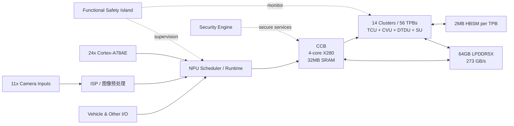

# 理想汽车马赫 M100 自动驾驶芯片深度研究报告

## 执行摘要

截至 2026-05-13，围绕“马赫（Mach）”首款公开芯片 **M100** 的一手证据，已经不只是发布会口号：`url理想汽车turn37search5` 的 2025 年年报确认 M100 已研发完成、计划 2026 年量产上车；同时，题为《M100: An Orchestrated Dataflow Architecture Powering General AI Computing》的论文已被 ISCA 2026 Industry Track 接收，公开了 SoC/NPU 组织、内存层次、编译器/运行时以及与 Thor-U 的 benchmark。就“架构是否真实存在、是否有系统化设计方法”而言，证据是**强**的；但就“完整产品规格是否齐备”而言，证据仍然**不完整**，因为论文明确写道，除 DDR 带宽和 die size 等基本指标外，M100 的详细性能规格并未正式披露。citeturn12view0turn21view0turn22view5turn24view1

如果把“真正创新”定义成“从零发明一个前所未有的基础计算范式”，M100 **不是**；数据流（dataflow）、软件管理片上存储（software-managed SRAM）、生产者—消费者同步（producer-consumer synchronization）、空间-时间调度（space-time scheduling）都已有长学术谱系。可是，如果把“真正创新”定义成“把这些思想以车规 SoC 的形式，面向自动驾驶（AD）、端到端/Transformer、VLA、LLM 推理，做成有明确微架构和编译器—运行时协同的量产方案”，M100 **是有实质创新的**，而且公开证据明显强于很多只停留在营销层面的“自研芯片”叙事。citeturn21view0turn22view0turn22view2turn23view2turn24view0turn20search3turn44search10turn49view1

与 `urlTeslaturn27search5` 的 HW3/FSD SoC 相比，M100 的核心差异不是“TOPS 更大”这么简单，而是**设计时代假设不同**：Tesla HW3 诞生于 CNN 主导、batch-size=1 为核心目标的 2019 年，采用非常强的专用 NNA 管线；M100 则显式瞄准 Transformer、UniAD、MindVLA、LLaMA 这样的更广义 AI 推理工作负载。与 `urlNVIDIAturn31search2` Drive Orin/Thor 相比，M100 牺牲了一部分通用 GPU 生态与开放性，换取更高工作负载利用率；与 `urlMobileyeturn32search3` EyeQ 家族相比，M100 追求更高单芯通用 AI 推理能力，而 Mobileye 更像是在“适度 TOPS + 高系统效率 + 安全方法学”上深耕。citeturn28view0turn23view0turn25view3turn39view0turn39view1turn33view0turn33view1turn33view3

综合判断：**M100 体现了真实的架构级创新，但现阶段更准确的表述应是“有力的、被一手文档支撑的体系化创新”，而不是“已由独立第三方完全证明的压倒性领先”。** 它最大的亮点在于“中间路线”——不走纯 GPU，也不走过于僵化的固定功能 ASIC，而是用“有弹性的数据流 NPU + 编译器/运行时协同”去平衡效率、确定性与未来模型演进；它最大的未证实点则是：**完整规格、功耗、ASIL 等级、AUTOSAR 适配、稀疏性硬件支持、第三方复现实测**都还欠缺公开证据。citeturn21view0turn22view5turn24view1turn48view0turn47view0

## 来源与证据边界

本报告优先级最高的证据层有三类。第一类是 `url理想汽车 2025 年年报turn10view0` 与 `urlM100 架构论文turn20search1` 这类官方材料；第二类是 `urlTesla Hot Chips 31 官方演讲稿turn28view0`、`urlNVIDIA DRIVE AGX Orin 官方开发平台手册turn39view0`、`urlNVIDIA DRIVE AGX Thor 官方开发平台手册turn39view1`、`urlMobileye EyeQ 官方页面turn33view0` 这类原厂/工程披露；第三类才是中文权威二手源，如 `urlIT之家马赫 M100 首发报道turn48view0` 与 `url腾讯新闻对谈理想 CTO 谢炎turn47view0`，用于补全“1280 TOPS”“5nm 车规级”“端到端延迟下降 40%”等管理层公开说法。citeturn12view0turn21view0turn28view0turn39view0turn39view1turn33view0turn48view0turn47view0

这里最关键的边界是：**M100 论文公开了微架构，但没有公开完整 datasheet。** 论文正文明确表示，写作时理想汽车并未正式披露 M100 的详细性能规格，公开的基本参数只有 DDR 带宽和 die size；因此，关于 **1280 TOPS、5nm 车规级、端到端延迟 -40%** 的信息，虽然来自管理层公开发声并被中文科技媒体详细转述，但其证据等级仍低于“论文/手册里的直接技术表格”。这不意味着这些说法不可信，而是意味着它们应被视为**管理层公开口径**，而不是“完整技术规格表”。citeturn22view5turn48view0

同样重要的是，**若公开资料没有写，就应明确标为“未公开/未说明”而不是脑补。** 对 M100 而言，精确功耗包络（power envelope / TDP）、ECC 方案、完整精度矩阵、片间互联正式规格、AUTOSAR 兼容状况、ISO 26262 ASIL 等级，都属于目前公开证据不足的项目。对比芯片中，`urlTeslaturn27search5` HW3 的 LPDDR4 带宽 68 GB/s 也更多来自工程披露复述和媒体技术总结，而不是 Tesla 官网产品页。citeturn22view5turn28view0turn40search13

## 马赫 M100 已知规格与芯片对比

先看 M100 目前**能被公开资料支持**的规格边界。下表把“已知”“推断”“未公开”分开列出，而不是混写。表内来源列即该行事实的主要证据。 

| 维度 | 已公开信息 | 备注 | 来源 |
|---|---|---|---|
| 名称/定位 | 马赫 M100 是理想自研自动驾驶/通用 AI 推理 SoC，2026 年起计划用于新车型 | “马赫”是产品线命名，公开技术披露集中在首款 M100 | citeturn12view0turn48view0 |
| 制程 / 面积 | **TSMC N5A**；**399.8 mm²** | “5nm 车规级工艺”来自管理层公开说法；N5A 与面积来自论文表格 | citeturn22view5turn48view0 |
| CPU / 控制复合体 | SoC 内 **24× Cortex-A78AE**；NPU 内有 **1 个 4 核 X280 CCB**，每个 TPB cluster 共享 **1 个 X280** | 即：应用 CPU 与 NPU 控制 CPU 分层存在 | citeturn23view0turn23view1 |
| NPU 组织 | **1 个 CCB + 14 个 TPB cluster × 4 TPB = 56 TPB** | 这是 M100 公开微架构最核心的组织关系 | citeturn23view0turn23view2 |
| TPB 内部 | 每个 TPB 含 **TCU / CVU / DTDU / CSU / GSDU / SU**，以及 **2 MB HBSM** | 属于“张量 + 向量 + DMA + CPU 辅助 + 同步”异构块 | citeturn23view3 |
| 张量阵列 | TCU 采用 **8×64 MAC array**；每个 MAC 每周期做 **4 元素 dot-product** | 论文给了功能级描述，但未正式给出完整峰值推导表 | citeturn22view4 |
| 外存 | **8 个 LPDDR5X 子系统，64 GB，总带宽 273 GB/s** | 这是论文明确披露的少数正式规格之一 | citeturn23view0turn22view5 |
| 片上存储 | CCB 内 **32 MB SRAM**；每个 TPB **2 MB HBSM**；合计约 **144 MB 片上 SRAM（推断值）** | 144 MB 不是厂商 headline，而是由 32 MB + 56×2 MB 推算 | citeturn23view1turn23view3 |
| 片上互联 | **2D Mesh Bus + Data Ring Bus + Instruction Chain Bus** | Mesh 负责点对点，DRB 负责确定性广播，ICB 负责长指令分发 | citeturn23view0 |
| 图像 / I/O | 最多 **11 路 camera** 经 MIPI-CSI 进入；含 ISP、VPU、UFS/QSPI、USB/Ethernet、低速接口 | SoC 公开重点是相机 ingress；其他传感器 ingress 细节未在论文里逐项表出 | citeturn23view0 |
| 安全 / 安全性 | 含 **Functional Safety Island（FSI）**、Security Engine；运行时监控错误/异常并满足 FuSa 要求 | 有“功能安全设计”和“安全岛”证据，但未见公开 ASIL 级别 | citeturn23view0turn24view1 |
| 编译器 / 运行时 | **space-time scheduler + graph compiler + backend compiler + firmware JIT** | 这是 M100 “方法论创新”最关键的一部分 | citeturn24view0turn24view1 |
| 精度 / 量化 | 公开 benchmark 演示了 **W8A8** 与 **W4A16** | 正式的 FP32/FP16/INT8/INT4 全矩阵未公开 | citeturn25view4turn26view0 |
| 功耗包络 | **未公开** | 论文只说对标 Thor-U benchmark 时使用“相同 power budget” | citeturn22view5turn25view3 |
| AUTOSAR / ISO 26262 | **未见公开 AUTOSAR 说明；未见公开 ISO 26262 ASIL 等级声明** | 只能确认有 FuSa/FSI；不能凭空写成“已通过某级认证” | citeturn23view0turn24view1 |
| 营销层性能口径 | **单芯 1280 TOPS**；“端到端延迟下降 40%”“车辆反应速度比人类快一倍” | 这些是管理层公开口径，不是论文 datasheet 表 | citeturn48view0 |

横向对比时，最好把“**单芯片/单 SoC 口径**”与“板级冗余方案”分开。下表统一尽量按**单颗主 SoC**来比；`urlTesla FSD SoC HW3turn27search5` 仅按**单 SoC**算，不把双 SoC 冗余板卡简单相加。 

| 芯片 | 制程 | CPU / 控制 | 公开算力 | 公开精度支持 | 外存 / 带宽 | 片上存储 | 架构 / 可编程性 | 安全隔离 / 公开功耗口径 | 主要来源 |
|---|---|---|---|---|---|---|---|---|---|
| url理想汽车 马赫 M100turn37search5 | N5A；399.8 mm² | 24× Cortex-A78AE；NPU 内 4 核 X280 + 14 个 cluster CPU | 1280 TOPS（管理层公开口径）；论文未正式公开完整 perf 表 | 已公开示例：W8A8、W4A16；完整矩阵未公开 | 64 GB LPDDR5X；273 GB/s | ~144 MB SRAM（推断） | 数据流 NPU；56 TPB；space-time scheduling；JIT firmware；显式 DMA/同步 | FSI + Security Engine；功耗未公开；同功耗预算下 UniAD 30 FPS、约 3.8× Thor-U | citeturn23view0turn23view1turn23view3turn24view1turn22view5turn25view3turn48view0 |
| urlTesla FSD SoC HW3turn27search5 | 14nm；260 mm² | 12× CPU cores；1× GPU；2× 独立 NNA | 约 73.6 TOPS / SoC（2×36.8 TOPS）；板卡为双 SoC 冗余 | NNA 主打 INT8；SIMD 支持整数与 FP32 算术 | LPDDR4；68 GB/s | 32 MB SRAM / NNA，合计约 64 MB | CNN 时代的专用 NNA；紧凑 ISA；limited OOO；batch-size=1 优化 | 双 SoC + 冗余电源 + 重叠传感链路；目标 <40W/SoC，整板 <100W；AEC-Q100 | citeturn28view0turn30search2turn40search13 |
| urlNVIDIA DRIVE AGX Orinturn31search2 | 在检索到的 Drive 官方资料中未逐项写明 | 12× Cortex-A78A；Safety MCU：Infineon Aurix TC397 | 254 INT8 TOPS | 官方 Drive 文档明确给出 INT8；更宽精度未在检索到的 Drive 文档逐项列出 | 32 GB LPDDR5；200 GB/s | 未公开 | CUDA Tensor Core GPU + DLA + PVA + OFA；DriveOS / DriveWorks / TensorRT | ISO 26262 safety-certifiable DriveOS；开发套件系统功耗 200W | citeturn39view0 |
| urlNVIDIA DRIVE AGX Thorturn31search2 | N4 / 415 mm²（来自理想对比论文；NVIDIA devkit 资料未重述 die/process） | Arm Neoverse V3AE；Safety MCU：Renesas U2A16 | 1000 INT8 TOPS；2000 FP4 | FP32 / FP16 / FP8 / FP4（官方开发资料） | 64 GB LPDDR5X；273 GB/s | 未公开 | Blackwell GPU-centric + PVA + OFA；面向生成式 AI；DriveOS / DriveWorks | ISO 26262 safety-certifiable DriveOS；开发套件系统功耗 350W | citeturn39view1turn31search17turn22view5 |
| urlMobileye EyeQ6Hturn32search3 | 7nm | 具体 CPU 数量未公开；为异构车载 SoC | 34 DL TOPS（INT8） | INT8（官方 benchmark 页面） | 未公开 | 未公开 | 高度垂直化异构架构；带 ISP/GPU/video encoder；EyeQ Kit 对 OEM 开放二次开发；可作为单芯环视 ADAS 中央处理器 | 精确功耗未公开；官方称较 EyeQ5H 计算力 3×、功耗仅 +25%；单 EyeQ6H 可处理至多 11 传感器的 Surround ADAS | citeturn33view0turn34view0turn35search3turn35search5turn33view3 |

需要特别补一句：`urlMobileye EyeQ Ultraturn32search1` 也值得纳入视野。它公开口径是 **5nm、176 TOPS、四类专有加速器**，目标是 L4 consumer AV；但带宽、片上存储、精度矩阵等公开细节反而少于 EyeQ6H，因此本报告主表采用“公开参数更完整”的 EyeQ6H，把 EyeQ Ultra 作为补充参照。citeturn33view1turn33view3

下图只比较“公开峰值口径”的数量级，而**不**代表相同工作负载下的真实有效性能；尤其是 M100 的 1280 TOPS 与 Thor 的 1000 INT8 TOPS、Tesla 的单 SoC 73.6 TOPS，在定义、代际、功耗边界与工作负载方面都不等价。citeturn48view0turn22view5turn28view0turn39view0turn39view1turn33view0

```text
公开峰值算力数量级（单芯片 / 单 SoC 口径，非等价 benchmark）

马赫 M100        1280 TOPS | ████████████████████████████████
DRIVE Thor       1000 TOPS | █████████████████████████
DRIVE Orin        254 TOPS | ██████
Tesla FSD HW3    73.6 TOPS | ██
Mobileye EyeQ6H    34 TOPS | █
```

## 架构分析

M100 的架构重点，不是“堆更多 MAC”，而是**把数据搬运（data movement）和调度（scheduling）提升到与计算本身同等重要的地位**。论文明确写到，M100 基本避免了多级缓存（largely avoids multi-level caches），转而让每个 TPB 依赖高带宽本地 HBSM、共享 SRAM、以及显式 DMA，在编译器和运行时控制下做张量流式执行。它把张量（tensor）而不是寄存器级指令作为主要执行粒度，并通过同步计数器（Synchronization Counters）实现生产者—消费者流水。这个设计明显是为了降低 cache hierarchy 对尾延迟（tail latency）和可预测性的破坏，属于典型的“为车端实时 AI 推理而裁剪”的取向。citeturn22view0turn22view2turn23view3

从微架构角度看，M100 也不是“纯粹的脉动阵列（systolic array）”。每个 TPB 里既有做卷积/矩阵乘的 TCU，也有能把 softmax、layer norm、pooling 等常见向量操作编排成流水的 CVU，还有支持转置/填充/广播的数据变换 DMA、支持不规则 gather/scatter 的 GSDU，以及在必要时由 cluster CPU 接管的标量/控制工作。因此，它更像是一个**张量主导、向量补位、CPU 扫尾**的异构块，而不是只擅长某一类 dense GEMM 的单一数据通道。citeturn23view3turn22view4turn24view0

M100 的另一层关键设计在于**层级化互联**。NPU 内部有 1 个 CCB 与 14 个 TPB cluster；cluster 内图形结构更紧凑，cluster 之间则通过 2D Mesh Bus 和 Data Ring Bus（DRB）完成点对点和广播通信。DRB 被用作“确定性、高效率广播路径”，Mesh 则承担更通用的高带宽点对点。这个“Mesh + Ring/Broadcast”的组合，配合指令链路 ICB 和极长张量指令，说明 M100 的思想并非“传统 CPU/GPU 式通用存储寻址”，而是“分布式执行块 + 显式通信 + 编排式同步”。citeturn23view0turn23view1turn23view2

软件栈是 M100 的核心，而不是外围。理想公开的工具链由 **space-time scheduler、graph compiler、backend compiler** 组成：前者把一个神经网络子图映射到 TPB 的空间位置和时间阶段；后者做图优化、动态 tensor 内存分配以及后端 intrinsic 生成；NPU firmware 再用 JIT 方式生成优化后的 TPB instructions，并在运行时动态计算 tensor shape 和地址。这意味着 M100 的“可用性”很大程度取决于编译器质量，而不是只看硬件框图。citeturn24view0turn24view1

按公开高层图，M100 的 SoC 组件关系可以概括为下图：相机输入走 ISP/预处理，任务由 scheduler 与 runtime 分发到 CCB 和 TPB 集群执行，FSI 与 security engine 负责监督和安全服务，应用 CPU 和 NPU 控制 CPU 分层协作。citeturn23view0turn23view1turn24view1



与 `urlTeslaturn27search5` HW3/FSD SoC 相比，M100 的差异非常本质。Tesla 在 Hot Chips 31 公开的设计是一颗**面向 batch-size=1 的高度专用推理芯片**：2 个独立 NNA、每个是 96×96 MAC 阵列，强依赖 SRAM 驻留、带专用 ReLU / pooling / quantization / compression 指令，目标是 >80% utilization、<40W/SoC，并允许 DMA read / write / compute 做有限乱序并行。这套设计对 2019 年主流 CNN 负载非常有效，但它的“硬化方向”也更强。相比之下，M100 明显给 Transformer、softmax、layernorm、动态图形状、甚至 LLM prefill/decode 留了更多结构空间。citeturn28view0turn24view0turn25view4

与 `urlNVIDIAturn31search2` Orin/Thor 相比，M100 走的是相反方向：Orin/Thor 以 GPU/SIMT + tensor cores 为中心，软件生态极强，DriveOS/DriveWorks/TensorRT 也成熟；但 M100 论文直接批评了 cache-based hierarchy 在 AD 推理上的优化难度和不可预测性。尤其值得注意的是，M100 在与 Thor-U 的论文 benchmark 里 **DDR 带宽相同（273 GB/s）**、die size 也接近，却在 UniAD 感知类任务上给出 3.8× 帧率提升；如果这个结果可复现，那么它更像是“利用率和数据搬运效率赢了”，而不是“内存规格赢了”。citeturn21view0turn22view5turn25view3turn39view0turn39view1

与 `urlMobileyeturn32search3` EyeQ 家族相比，M100 也不是简单的“更大 TOPS”。EyeQ6H 公开强调的是**低功耗、高效率、适度 TOPS、深度垂直整合**，还把 ISP、GPU、视频编码塞进单 SoC，并通过 EyeQ Kit 给 OEM 开放二次开发；EyeQ Ultra 则用四类专有加速器，面向 camera-only 与 radar+lidar 双冗余 sensing subsystem。Mobileye 的哲学更接近“用刚刚够用的算力把整车安全和量产体系做扎实”，而不是用更大的 headline TOPS 去证明自己。M100 则更主动地拥抱“车上跑更广义 AI 模型”的未来。citeturn33view0turn34view0turn33view1turn33view3turn35search5

## 创新性判断

**能算“真实创新”的部分**，首先是它公开了一个明确的“中间路线”。M100 论文在动机层面非常清楚：GPU 平台太通用，成本、TCO、cache 不确定性和未用特性太多；而过窄的 DSA 虽高效，却容易被快速演化的端到端/VLA/LLM 算法淘汰。M100 想做的是一类可扩展、模块化、以 dataflow 为核心、但又保留向量/CPU/不规则操作处理能力的边缘推理 SoC。这个目标本身并不新，但把它落成**有 SoC 图、有 NPU 图、有编译器、有 benchmark 的车端产品形态**，本身就已经超出“概念创新”的层面。citeturn21view0turn23view0turn24view0turn16view0

第二，M100 的创新更像**体系集成创新（system integration innovation）**。单个部件都能在学术史里找到前身：dataflow 来自经典研究，TPU 式大阵列证明了张量专用单元的价值，软件定义 tensor streaming 也已有工业路线，而自主机器的 dataflow accelerator 论文也明确提出过“自动驾驶/自动机器更适合数据流”的判断。M100 的新意在于：把这些思想与车规 SoC 的安全岛、相机 ingress、集群划分、yield 余量、模型团队协同、JIT runtime 接在一起，形成一个**面向汽车产品周期**的整体方案。citeturn20search3turn44search10turn49view1turn21view0turn25view0

第三，M100 的**编译器—硬件共设计（compiler-hardware co-design）**是真正的亮点之一。理想公开说法里，团队不是先定参数，再逼模型去适配；而是先花半年分析 workload 的计算特征，再定义 tile、总线、CPU/NPU 交换带宽和 I/O。这与论文里的 space-time scheduler、tensor partition、loosely sorted instruction stream、runtime JIT 一一对应。对一颗 intended-for-production 的汽车 SoC 来说，这种“model / compiler / OS / hardware 一起定义”的程度，本身就说明它与“拿第三方 NPU IP 拼一颗芯片”是不同层级的事情。citeturn24view0turn24view1turn47view0

**不能算“已被坐实的创新”** 的部分也必须明确。首先，M100 目前没有公开证据证明它在**硬件稀疏性（sparsity）**上有多强。公开材料展示了 W8A8 和 W4A16 量化，也展示了 MoE workload 的 benchmark，但没有看到明确的零跳过（zero-skipping）、块稀疏（block sparsity）、压缩格式硬件解码、结构化稀疏单元等说明。与文献中对 sparse accelerator 的明确硬件支持相比，M100 在这一点上仍然是不透明的。citeturn25view4turn26view0turn49view3

其次，M100 的**功能安全证明链**还不够完整。公开资料能支持它有 FSI、有 security engine、有运行时错误监控、有“满足 FuSa requirements”的目标；但无法支持“已公开达到某个 ISO 26262 ASIL 级别”或“已公开具备某种 AUTOSAR 兼容层”。对汽车芯片来说，这是一个不能用“应该有”代替“已经公开”的领域。citeturn23view0turn24view1

再次，M100 的 benchmark 仍然以**厂商主导实验**为主。论文比较对象是 Thor-U，且 UniAD 测试只启用 8/14 clusters，把剩余 6 个 cluster 留给 cockpit functions；LLM 测试则用 12/14 clusters，并说明这样做是为了 yield。这个结果本身非常有意思，说明 M100 有做空间分区和多域隔离的能力；但在没有第三方复现实测、没有统一公开 benchmark harness、没有更宽 workload 覆盖之前，结论应当是“有力证据”，而不是“最终定论”。citeturn25view0turn25view3turn26view0

还有一个现实的参照：`urlTeslaturn27search5` 在 2026 年已经明确承认，HW3 的内存带宽对无监督/更高阶 FSD 已经不够。这并不是为了贬低 Tesla，而是说明**模型代际更替会迅速暴露早期芯片的架构边界**。M100 的全部设计叙事都在试图避免这个问题——它从一开始就把 UniAD、LLaMA、MindVLA 视为目标工作负载；但这件事是否真的做对，必须等它经历几轮真实 OTA 模型升级后才算盖棺。citeturn27news40turn21view0turn25view4turn26view0

因此，我的结论是：**M100 体现的是“强工程创新 + 中等到较强的架构创新”，不是“从理论到器件全栈首创”；它最值得肯定的是把 dataflow 这条久被讨论、少有车端量产级落地的路线，做成了有论文、有微架构、有工具链、有车产品承载的方案。** 但在功耗、稀疏支持、安全认证、软件生态和第三方验证这些决定“是不是长期赢家”的变量上，它仍处于需要继续观察的阶段。citeturn21view0turn24view1turn48view0turn47view0

## 通用 AI 芯片架构与车规取舍

汽车场景对 AI 芯片的要求，和数据中心不完全一样：它既要有足够算力，也要在**低时延、确定性、功耗、热约束、功能安全、车型生命周期**之间找到平衡。M100 论文、TPU 经典论文以及 autonomous machine 的 dataflow 文献，都指向同一个结论：车端并不是“谁 TOPS 最大谁就赢”，而是谁能在**尾延迟、有效利用率和可验证性**上做出更好的权衡。citeturn21view0turn44search10turn20search3

| 架构类型 | 代表思路 | 车端优点 | 车端短板 | 主要依据 |
|---|---|---|---|---|
| CPU | 通用顺序控制流、OS、异常处理 | 最适合控制、调度、诊断、安全岛和复杂分支逻辑；认证路径相对成熟 | TOPS/W 最差，不适合大规模 tensor contraction | citeturn21view0turn44search10 |
| GPU / SIMT | Orin / Thor 这类 CUDA Tensor Core 路线 | 生态成熟，模型迁移快，编程灵活，支持广泛 | cache、warp/scheduler、通用性冗余导致实时性与功耗未必最佳；热设计压力大 | citeturn21view0turn39view0turn39view1 |
| 脉动阵列 / TPU 式 | 大规模 MAC array 做固定张量核 | dense matmul / conv 极高能效，可做较强确定性执行 | 对 irregular op、动态图、控制流适应较弱；若过度硬化，生命周期缩短 | citeturn44search10turn28view0 |
| 数据流 / Streaming | M100、autonomous machine DAA、tensor streaming 路线 | 数据搬运可显式优化，易获得高并行和确定性；更适合车端 batch=1/streaming inference | 编译器和调试复杂度高；软件栈是成败关键 | citeturn20search3turn49view1turn21view0 |
| CGRA / 空间架构 | 可重构 tile / spatial dataflow | 在效率和灵活性之间取中间值，适应多种 kernel | 编译映射、验证、工具链成本高，车规落地并不轻松 | citeturn49view3 |
| 车规异构 NPU / DSA | Mobileye EyeQ、部分 Tesla 路线 | 对已知 ADAS/AV pipeline 能做到很高系统效率和低 BOM；安全方法学更容易内建 | 对模型范式突变更敏感；开放性和生态一般弱于 GPU | citeturn33view0turn33view1turn33view3turn28view0 |

把这些架构放到“**领域专用（domain-specific） vs 通用（general-purpose）**”这条轴上看，最左侧是高度专用的车规 DSA，最右侧是通用 GPU。左侧的好处是高能效、可预测、低 BOM；坏处是模型范式一变，芯片就可能过时。右侧的好处是软件生态和算法迁移速度快；坏处是你为灵活性支付了大量功耗、缓存控制和热预算。M100 的目标很明确：**做中间解**。论文甚至把这件事直接写出来：它希望比 GPGPU 更高效、比窄 DSA 更灵活。这个定位本身就是对“AI 汽车芯片究竟该是专用还是通用”争论的正面回答。citeturn21view0turn44search10turn33view2

也正因为如此，TOPS 在汽车里从来不是充分指标。`urlMobileyeturn32search3` 一直在强调“modest TOPS + high efficiency”；`urlTeslaturn27search5` 的 2019 FSD SoC 追求的是“高利用率 + batch-1 + 低功耗 + 冗余”；`urlNVIDIAturn31search2` 则用更宽软件生态和更高通用性去覆盖更多变化中的模型；M100 的不同点，是把“高利用率”和“更宽泛 AI 负载支持”绑定进一个数据流—编译协同路线。是否成功，不该只看峰值算力，而要看**J/frame、p99 latency、mixed-domain QoS、模型迁移代价**。citeturn28view0turn39view0turn39view1turn33view2turn25view3

## 进一步验证建议

如果要把“马赫是否真的领先”这件事从厂商叙事变成工程结论，最有价值的验证不该是再问一次“多少 TOPS”，而应该测试**有效利用率、尾延迟、功耗密度、混合负载隔离、安全恢复时间和模型迁移成本**。M100 论文与 TPU 论文都已经隐含这一点：实时系统看的是确定性和 utilization，不是单一峰值。citeturn25view3turn44search10

建议优先做以下验证。其一，做 **shape sweep / op sweep**：从 CNN、BEVFormer、UniAD，到 LLaMA prefill/decode，再到 MoE/VLA，测不同 tensor 形状下的吞吐与 stall 分布，确认 M100 是否只在厂商挑选的“合适形状”上占优。其二，做 **memory & overlap profile**：测 DRAM bytes/FLOP、HBSM 占用率、DMA/compute overlap ratio、同步计数器等待时间，验证“数据流优势”究竟来自哪里。其三，做 **mixed-domain QoS**：复现论文中“8 个 cluster 跑 AD、6 个 cluster 留给 cockpit”的场景，测试 p50/p99/p99.9 latency、任务抢占、热稳定性和长期 jitter。其四，做 **power/thermal sweep**：在冷车、高温、长时运行下测 joules/frame，而不是只测短时峰值。其五，做 **safety fault injection**：人为打挂 TPB、DMA、同步计数器或 sensor path，测 FSI/运行时是否能在车规时间窗内退出、降级和恢复。其六，做 **toolchain portability**：看现有 PyTorch/TensorRT 风格模型迁移到 M100 编译栈，需要多少图改写、多少手工 kernel、多少 layout 调优。其七，做 **longitudinal OTA test**：隔 6–12 个月换一代模型再测一次，看看 M100 是否真能比更窄的 DSA 更抗算法代际变化。其八，做 **第三方复现实验**：哪怕不是公开给所有人，也至少应由独立研究机构或 Tier-1 在统一 harness 上复测。  

如果经过这些测试，M100 仍能在 **相同功耗预算** 下维持更高有效利用率、更低 p99 latency、更低迁移成本，并且在两轮以上模型演进后不显著掉队，那么“它具备实质架构创新”这一判断会比今天强得多。相反，如果优势只存在于少数特定工作负载或重度手工编译调优场景，那它更像是一颗“对自家模型非常合适”的垂直优化芯片，而不是更广义的下一代车端 AI 架构。  

## 优先来源

- urlM100 架构论文《M100: An Orchestrated Dataflow Architecture Powering General AI Computing》turn20search1  
- url理想汽车 2025 年年报turn10view0  
- url腾讯新闻对谈理想 CTO 谢炎turn47view0  
- urlIT之家关于马赫 M100 的首发报道turn48view0  
- urlTesla Hot Chips 31 官方演讲稿turn28view0  
- urlTesla IEEE Micro 论文入口《Compute Solution for Tesla's Full Self-Driving Computer》turn30search2  
- urlNVIDIA DRIVE AGX Orin 官方开发平台手册turn39view0  
- urlNVIDIA DRIVE AGX Thor 官方开发平台手册turn39view1  
- urlMobileye EyeQ 官方产品页turn33view0  
- urlMobileye EyeQ Ultra 官方发布说明turn33view1  
- urlGoogle TPU 经典论文《In-Datacenter Performance Analysis of a Tensor Processing Unit》turn44search10  
- urlDataflow Accelerator Architecture for Autonomous Machine Computingturn43search2  
- urlA Survey of Accelerator Architectures for Deep Neural Networksturn49view3