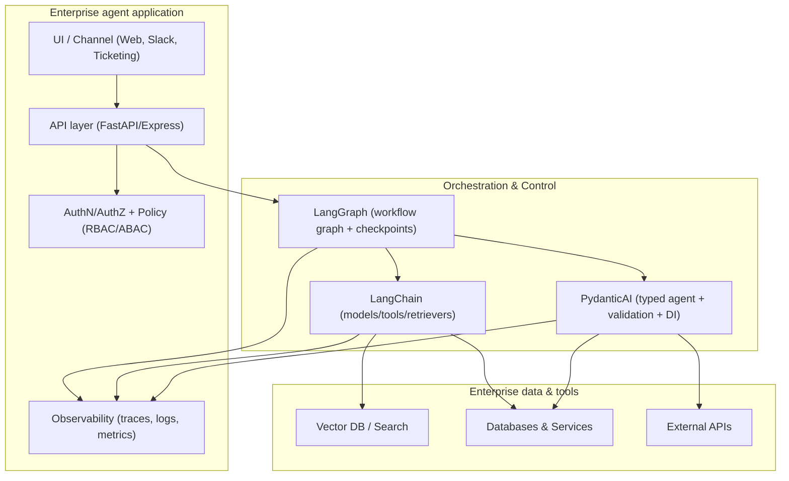
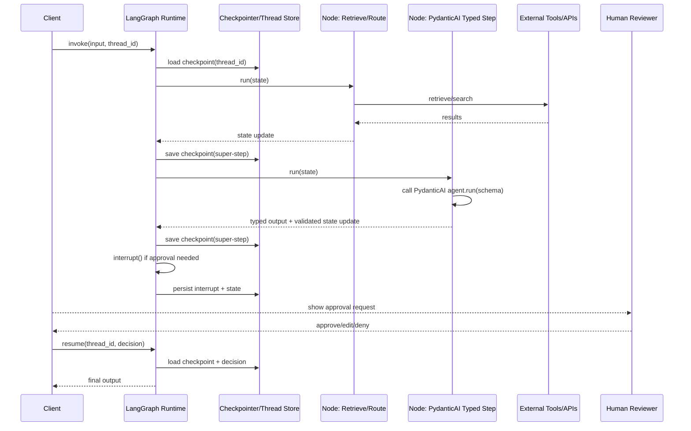

# 面向企业级 Agent 系统的 PydanticAI、LangChain 与 LangGraph 对比

## 执行摘要与场景化建议

在企业级 Agent 系统里，这些选项的实际差异，与其说是“能不能调用工具”，不如说是你希望把正确性与控制力主要落在哪一层：类型/Schema 边界（PydanticAI）、组件/集成边界（LangChain），还是工作流/状态边界（LangGraph）。PydanticAI 明确围绕类型安全的 Agent、由 Pydantic 派生的 JSON Schema、校验与“反思/自我纠错”循环来构建。LangChain 是以集成为重心的框架，核心是可组合的 “Runnables”（LCEL）以及庞大的工具/模型生态；它也提供结构化输出与工具调用辅助能力，并提供类似 LangServe 的部署方式。LangGraph 是一个用于持久化、状态化 Agent 工作流的图式编排运行时（nodes/edges/state），通过基于 checkpoint 的持久化来支持恢复执行、人类参与（human-in-the-loop）的中断，以及 time travel 调试。

对大多数企业而言，“默认”的生产架构往往是：把 LangChain 当作集成工具箱（模型、检索器、连接器、解析器），把 LangGraph 当作编排/运行时（可持久化状态、分支、可恢复执行、人类复核）。这也是 LangChain 对两者关系的定位方式：LangChain 的高层 Agent 可以在需要更深控制时用 LangGraph 原语来实现。PydanticAI 最适合那些以类型化契约与 schema 强制为首要诉求的场景（例如受监管流程、API-to-API 的“agent as a service”、或工具密集型自动化，其中参数校验与结构化输出必须可靠）。

### 按常见企业场景给出建议

| 场景 | 典型企业诉求 | 推荐起步方案 | 何时更偏向其他选项 |
|---|---|---|---|
| RAG 为主的助手（客服、内部知识检索） | 快速集成多种检索器/向量库与模型提供方；结构化输出用于引用与动作载荷；可观测性 | LangChain 负责集成 + LangGraph 负责有状态检索决策与 checkpoint 执行 | 当下游系统要求严格的 schema-first 契约、需要运行时校验/重试，并希望依赖注入与输出校验器作为一等模式时，更偏向 PydanticAI |
| 业务流程自动化（审批、工单、财务运营） | 人类参与审批、跨小时/天的可恢复执行、可审计性、鉴权边界 | LangGraph：interrupts + 持久化（durable execution）以及服务端鉴权中间件 | 如果你已经运行可靠的工作流基础设施（例如 Temporal 等），并希望以强 schema/校验来配合“durable execution 适配器”，可考虑 PydanticAI |
| 多 Agent 协作（专家子 Agent、并行研究、代码评审循环） | 明确控制 Agent 交接、并行分支、子图、按 Agent checkpoint | LangGraph（graph/subgraph 编排、Send/map-reduce 并行、time travel） | 当你希望通过“工具调用”完成多 Agent 委派，并且编排复杂度仍属中等时，可偏向 PydanticAI（typed deps + typed outputs） |
| 生产流水线（批处理增强、类 ETL 的 agentic 处理） | 异步/批处理执行、可预测 IO 边界、可扩展服务、成本控制 | LangChain LCEL/Runnables：批处理/并行组合 + LangServe：API 化服务 | 当你需要 checkpoint 的长时工作流（重试、无需重算即可恢复）以及图级 state/history 用于审计时偏向 LangGraph；当你需要每一步都输出 schema-校验后的数据并希望强依赖注入/校验时偏向 PydanticAI |

## 架构与核心抽象

### PydanticAI 的核心模型：类型化 Agent + 类型化依赖 + 类型化输出

PydanticAI 的顶层抽象是一个 “Agent”，它对依赖类型与输出类型是泛型化的，显式设计目标是：Agent 运行返回的是静态类型（并在运行时校验）的输出对象，而不是非结构化字符串。依赖通过 `RunContext` 的依赖注入模式传入，意图是让工具、系统提示、校验器具备可测试性与上下文感知（例如用户/会话、数据库句柄、HTTP 客户端）。

结构化输出是核心：Pydantic 模型会自动生成 JSON Schema 并发送给模型，最终输出会被校验；当校验失败时，框架可以请求重试（“反思/自我纠错”）。PydanticAI 还提供 “output validators”，用于处理纯 Pydantic 校验不便或无法完成的检查（例如需要 IO 的异步校验、外部查询等）。

当编排复杂度超出单一 Agent 循环后，PydanticAI 的文档给出逐级演进路径，最高复杂度包含基于图的控制流，并提供图库（`pydantic-graph`），支持 state、持久化快照，以及（beta API 中）声明式分支与并行执行（spread/broadcast/join）。

### LangChain 的核心模型：集成生态 + 可组合的 Runnables/LCEL

LangChain 围绕可组合的 “Runnables” 与 LangChain Expression Language（LCEL）构建，LCEL 提供声明式方式来构建支持同步、异步、批处理与流式输出的生产程序。实践中，企业把 LangChain 当作组件“市场”：模型提供方、检索器、工具、提示模板、输出解析器，以及部署辅助能力。

工具（Tools）是一等公民，通常通过 `@tool` 装饰器创建，Python 类型提示定义工具输入 schema，docstring 变为工具描述。基于工具之上，LangChain 提供 “Agents” 以实现可多次调用工具的行为，包括在适用时并行工具调用，以及工具重试/错误处理。

在部署方面，LangServe 的目标是把 LangChain 的 runnables/chains/agents 以 REST API 方式暴露出来，自动推断 JSON Schema，并提供 invoke/batch 等端点，面向实用的生产服务化。

### LangGraph 的核心模型：将工作流建模为带持久化与运行时保证的状态图

LangGraph 显式将 Agent 工作流建模为图，包含三大核心组件：共享 state、节点（函数）与边（控制流），支持条件分支与用于并行执行的 “super-steps”。其内置持久化层会在每个 super-step 将图 state 保存到一个 thread 下的 checkpoint 中，从而实现 durable execution、memory、time travel、容错以及 human-in-the-loop 等模式。

LangGraph 同时提供 Graph API 与 Functional API，二者共享同一运行时；文档建议：当你需要显式 state 管理、分支、带合并的并行路径，以及工作流可视化时，优先使用 Graph API。



## 详细能力对比

下表把你关心的企业维度映射到具体能力，并标注每个能力主要“落在”哪一套生态中。

### 能力对比矩阵

| 维度 | PydanticAI | LangChain | LangGraph |
|---|---|---|---|
| 主要抽象 | 类型化 “Agent”，对依赖类型与输出类型做泛型；结构化输出与校验是核心 | “Runnables” + LCEL 用于组合程序；其上叠加 “Tools” 与 “Agents” 实现工具使用行为 | “Graph”：共享 State、Nodes、Edges；面向长时、有状态工作流的编排运行时 |
| 架构契合点 | 更像服务内部的“类型化 agent 内核”；编排通过 `pydantic-graph` 与/或外部工作流引擎完成 | 更像集成层与组合工具箱（模型/检索器/工具/解析器）；可用 LangServe 对外服务化 | 更像 agent 工作流的编排内核/运行时；与 LangChain 组件可深度集成，但也可独立使用 |
| 类型与 schema 强制 | Pydantic 模型生成 JSON Schema；运行时校验；校验失败可重试；output validators 可做语义/IO 校验 | 结构化输出 API 支持工具调用策略或 provider 原生策略；支持 schema 类型（含 Pydantic）与重试机制 | state schema 是核心（常用 TypedDict/Pydantic）；checkpoints 持久化 state；对“转移”有强控制，但它本身不是专门的结构化输出框架 |
| 工具/函数调用 | 通过装饰器注册工具；工具参数由 Pydantic 校验；校验错误可反馈给模型并重试 | `@tool` 用类型提示定义输入 schema、docstring 作为描述；Agent 层支持多步工具调用与重试/错误处理 | 通常复用 LangChain 的工具/模型；节点可执行工具，图运行时控制顺序与并行；可用 Send API 做 map-reduce |
| 自动生成 schema | Pydantic 模型 → JSON Schema（输出与工具参数）；这是核心设计目标 | 工具 schema 来自类型提示；可选 Pydantic `args_schema`；结构化输出可直接接收 schema 类型 | state schema 与节点 I/O 由开发者定义；运行时聚焦 state 转移/checkpoint，而非 schema 发布 |
| 重试与错误反馈循环 | 在校验失败时“反思/自我纠错”；支持 `ModelRetry`；工具与输出校验错误可回传给模型 | 结构化输出文档描述“智能重试机制”；可用 ToolMessage 回传错误并促使重试 | 节点级 `RetryPolicy` 处理瞬态失败；也可把错误放入 state 并路由回可恢复节点实现 LLM 可修复循环 |
| 编排与工作流 | 多 Agent 指南把基于图的控制流作为最高复杂度；`pydantic-graph` 支持 state 持久化与可恢复；beta API 提供声明式并行/join/reducers 与 mermaid 图 | 多通过 LCEL 管道完成编排；也有“agent loop”抽象，但深度工作流控制通常在生态里交给 LangGraph | 图式编排：分支、并行、子图；支持 interrupts、time travel 与基于 checkpoint 的 durable execution |
| checkpoints 与可恢复 | `pydantic-graph` 在节点前/后持久化快照；内置内存与文件持久化，并建议生产使用自定义持久化后端 | LangChain 本身不是 checkpoint 化工作流运行时；其长时记忆/持久化通常依赖 LangGraph 的 persistence | 内置 checkpointers；每个 super-step 保存 checkpoint，并以 thread 组织以便后续访问与恢复 |
| memory 与 state | 可访问消息历史；通过 message history 继续对话是一级模式 | memory 常用 `RunnableWithMessageHistory` 与外部 chat history 存储；持久化后端通常由你负责 | 显式短期 memory 作为 state + thread 级 checkpoints；长期 memory 作为 JSON 文档存到 store（namespace/key），面向生产 |
| 可观测性与遥测 | 内置 instrumentation 使用 OpenTelemetry 语义约定；可发送到任意 OTel 后端（包括 Logfire） | callback 系统支撑 logging/tracing/streaming；与 LangSmith 深度集成，并支持通过 OpenTelemetry 向 LangSmith 上报 | 可观测性为一等能力；运行与 checkpoint 结合 LangSmith 监控；平台/SDK 提供 run-thread 可视化 |
| 成本监控 | Pydantic AI Gateway 宣称提供实时成本监控、支出控制与 provider 故障切换路由 | LangSmith 提供成本/时延跟踪与监控仪表板 | LangGraph OSS 本身不含成本面板；通常依赖 LangSmith/Tracing 与 checkpoint 感知遥测 |
| 安全与护栏原语 | 强 I/O 校验（Pydantic + output validators）；通过 deferred tools 做工具审批；文档覆盖 durable execution 模式 | 提供结构化输出与工具 schema；更广泛的护栏通常需额外层；prompt injection 风险在生态中被明确讨论 | 通过 interrupts 支持 human-in-loop；部署侧可用 auth middleware 与自定义鉴权；RBAC 通常在平台/网关层实现 |
| RBAC / SSO | Gateway 页面宣称提供 SSO 与精细权限（但 gateway 是独立组件且为 AGPL 授权） | LangSmith Enterprise 提供 RBAC/SSO（平台能力，不是 OSS 库能力） | 部署可用 auth middleware；RBAC 多在 API 网关/平台层实现 |
| 可扩展性与模型/provider 支持 | 模型无关；内置支持列出 OpenAI/Anthropic/Gemini/Bedrock/Groq/Mistral/OpenRouter 等 | “任意模型/工具的集成”是核心卖点；extras 覆盖众多 provider | 可脱离 LangChain 使用，但文档常以 LangChain 工具为例；实践中 provider 覆盖多继承自 LangChain 集成面 |
| 部署与运维 | durable execution 通过与工作流引擎集成（例如 Temporal）；gateway 提供 failover/routing 与统一密钥 | LangServe 部署 API（schema 推断、batch 端点）；LangSmith 提供 hosted/hybrid/self-hosted 选项（自托管常属企业范围） | LangGraph Platform 面向部署/管理长时、有状态 Agent；OSS 库含持久化；CLI/server 生态通常以数据库做 checkpoint |
| 语言/生态与许可 | Python（MIT）。Gateway 为独立组件（AGPL-3.0）。 | Python + JS/TS（MIT） | Python + JS/TS（MIT） |
| 成熟度与稳定性信号 | 2025 年 9 月达到 V1 并承诺 API 稳定；版本策略指出 V2 最早不早于 2026 年 4 月（按文档撰写时） | 生态大且成熟；演进速度快；有较完善的培训资源（LangChain Academy） | 定位为有状态 Agent 的底层编排运行时；平台 GA 于 2025 年 5 月公布 |

## 编排、状态与运维就绪度

### 在失败情况下的工作流控制与正确性

企业往往需要回答“中途失败时会发生什么”（provider 超时、工具错误、人类复核延迟、部署重启等）。LangGraph 的主要差异点在于：checkpoint 是运行时的一等概念——每个 super-step 保存 state，之后可在不重算前置步骤的情况下恢复（durable execution）。interrupts 会显式持久化 state 并暂停执行，直到恢复，从而支持可无限期等待的人类复核（approve/edit/respond）。time travel 是一个显著的调试/审计能力：你可以从历史 checkpoint 恢复（可选修改 state）以探索不同结果，并形成分叉历史。

PydanticAI 对 durability 的路径不同：核心库更强调以校验驱动正确性，并把 durable execution 作为与 Temporal 等工作流引擎的集成方式（由工作流引擎提供可靠 state 跟踪、重试与长时等待）。另外，`pydantic-graph` 通过在节点前后保存 state 快照来提供可恢复能力（内置内存与文件持久化，并支持扩展后端）。

LangChain 单独使用时并非 durable checkpoint 化工作流运行时；它擅长组合、集成与服务化，而在其生态里，“durable agent workflow”的故事通常会引导到 LangGraph（例如 LangChain agents 通过 LangGraph persistence 实现 long-term memory）。

### 并行、分支与长时负载

LangGraph 的 Graph API 支持分支与 map-reduce 模式；文档描述了对并行节点执行（fan-out/fan-in）的原生支持，并可用 Send API 实现 map-reduce，且并行节点作为同一 super-step 执行。Functional API 也通过 “tasks” 支持并行，并与 checkpoint、可重试工作与可观测性绑定。

Pydantic 的 beta graph API 明确宣称提供并行路径的声明式控制（broadcast/spread）以及 join/reducers，并支持 Mermaid 图生成用于工作流可视化。在原始 `pydantic-graph` 文档中，可恢复是重点，并指出当时并行节点执行存在限制。

LangChain 的并行能力最强在管道/组合层：Runnables/LCEL 支持 async/batch/streaming，并提供 `RunnableParallel` 进行并行组合。LangServe 则提供 invoke/batch 端点，并把并发与批处理作为部署收益之一。

### 可观测性、成本与运维控制

在遥测上，PydanticAI 强调其 instrumentation 原生使用 OpenTelemetry，并遵循 GenAI 语义约定，可与任何 OTel 后端（包括 Logfire）兼容。LangSmith 提供 tracing 与监控，并支持 OpenTelemetry 摄取，同时定义 trace/run/thread 概念模型来覆盖多轮 Agent 执行。这对于企业互操作性很关键：即使采用某个厂商平台，也能减少对专有 tracing 协议的锁定。

成本控制更常见于“平台/网关”层而非 OSS 库层。Pydantic AI Gateway 被定位为多 provider 统一接口，提供内置 OTel 可观测性、成本监控与 failover 路由，并以 AGPL-3.0 开源，支持托管或自托管。LangSmith 则宣传成本跟踪与监控，并在 Enterprise 文档中描述了 RBAC/SSO 等组织级控制能力。

性能/成本取舍常常取决于重试与校验。LangChain 的结构化输出文档明确承认模型会犯错并描述重试机制。PydanticAI 同样在校验错误时重试，并且还记录了在 streaming 长结构化输出场景中，对部分校验做去抖（debouncing）以降低开销。LangGraph 的 checkpoint 会在每个 super-step 写入 state——带来可恢复与 time travel，但也引入写放大，需要对持久化后端（尤其数据库 checkpointers）进行容量规划与监控。

## 生态证据与代表性开源项目

本节回答“真实的 agent 应用在做什么（以及为什么）”，包含你点名的项目与生态内具代表性的开源项目。

### LangChain 生态中的 LangGraph“agent 应用”

Open Deep Research 作为“open deep researcher”发布，强调可配置（自选模型、搜索工具与 MCP servers），并明确基于 LangGraph 构建。这是一个典型例子：把 LangGraph 当作工作流骨架，使研究步骤、分支与工具使用可控，而不是隐藏在单体 agent loop 里。

Open SWE 是基于 LangGraph 的开源异步编码 agent（并部署在 LangGraph Platform 上），并明确将“对步骤的控制”“按 agent 管理 state”“更好处理边界情况”作为选择 LangGraph 的理由；它也提到用 LangSmith 调试与评估“context engineering”。这对企业式需求是一个强数据点：长时运行（有时约 1 小时）、human-in-the-loop 由 persistence 支撑、以及对大量并发运行的自动扩缩容等，都在公告中归因于 LangGraph Platform。

此外，Agent Inbox 的 LangGraph.js 示例仓库提供了一个最小的 human-in-the-loop 参考实现：本地运行 LangGraph server，在 “human” 节点 interrupt，并在复核 UI 中操作后 resume。它对应了常见企业流程（review/approve/edit）：暂停执行必须经得起延迟并可审计。

### PydanticAI 生态中的“agent 应用”：强调类型契约与测试

PydanticAI Research & Email Agent System 仓库自述为生产可用系统，使用 PydanticAI 结合网页研究与 Gmail 草稿输出，并强调 agent 委派（research agent 委派给 email agent）、CLI streaming 输出，以及用 test model 与 mock services 做“mock testing”。这体现了团队采用 PydanticAI 的常见原因：以 schema 约束输出与可测试性模式，更接近传统后端工程，而不是临时的 prompt glue。

### OpenCode 与 OpenClaw：更像“agent 产品/运行外壳”而非通用框架

OpenCode（`opencode-ai/opencode`）自我定位为 Go 语言 CLI 助手，带 TUI，用于与模型交互完成编码任务。另一个高 star 的 `anomalyco/opencode` 仓库也自称为开源 coding agent，并强调 provider 无关（可用 Claude/OpenAI/Google/本地模型）。这些项目更适合被理解为“agent 产品/运行外壳”而不是通用的企业框架：它们展示了一个有主张的 agent 运行时是什么样子，但其工程约束（CLI 体验、本地沙箱、代码库上下文访问）与企业后端常见需求并不完全一致。

OpenClaw 同样更像 agent 产品/外壳，在仓库呈现的功能里包括“first-class tools”与多渠道动作（如 Discord/Slack）。从企业决策者视角，这类项目更像提醒：工具访问、沙箱与审批必须显式设计，与使用哪个框架无关（例如可参考 OWASP 关于 prompt injection 的指导）。

### 反映企业采用压力的行业集成

主流云厂商发布 LangGraph/LangChain 的集成指南/教程，体现生态动量与生产兴趣（例如 AWS 对 LangChain/LangGraph 的指南、以及在 Bedrock 上的多 Agent 模式）。这些并非“优越性证明”，但属于实用信号：培训、模板与参考部署能降低符合云标准约束企业的采用风险。

## 迁移与集成模式

### 结合 PydanticAI 与 LangGraph：在持久化编排器中使用类型化节点

一个常见企业模式是：把 LangGraph 当作工作流内核（状态机、checkpoints、interrupts），在特定节点中使用 PydanticAI 以实现严格的 schema 约束推理步骤或工具参数校验。

其合理性在于：

- LangGraph 通过持久化层提供 checkpoint state、interrupts、time travel 与 durable execution 语义。  
- PydanticAI 提供强类型输出、工具参数校验、output validators 与基于校验失败的重试循环。

一个可行的集成方式是：把 PydanticAI 的 message history（或其序列化形式）存入 LangGraph state，以便图能在中途恢复并让 PydanticAI agent 连贯续跑。PydanticAI 把 message history 作为继续对话与检查的重要概念；LangGraph 的 state 与 checkpoints 则用于跨步骤持久化与恢复 thread 级 state。



### 从 LangChain agents 迁移到 LangGraph workflows

如果你已有 LangChain 的“agent loop”（tools + LLM）但需要更强控制，常见迁移路径是：

1. 保留已有的模型/工具定义（LangChain `@tool` 与集成）。  
2. 用 LangGraph graph 重建控制流，以显式管理 state、加入 checkpoints，并实现 interrupts/human review。  
3. 在节点边界加入 retry policy（例如网络错误），并用 state 表达失败，从而实现 LLM 可修复循环。

LangGraph 文档对这种分工给出了明确框架：LangChain 提供预置 Agent 架构；LangGraph 提供更底层的编排能力，用于深度定制与 durable execution/human-in-loop。

### 迁移到 PydanticAI 以获得严格类型与 schema 强制

如果你的主要痛点是“工具参数或输出漂移导致下游系统频繁被破坏”，迁移到 PydanticAI 的策略通常是：

- 用 Pydantic 输出模型替代非结构化的“最终答案”文本，让它同时成为 schema 与运行时契约（校验失败自动重试）。  
- 把上下文装配（用户身份、鉴权 token、DB/session 句柄）移入通过 `RunContext` 传入的类型化依赖，以提升可测试性并减少全局状态。  
- 为需要 IO/异步的业务不变量检查加入 output validators（例如验证 ID 存在、校验权限、强制业务约束）。

### 跨生态的可观测性集成模式

两套生态都在向 OpenTelemetry 收敛。PydanticAI 表示其 instrumentation 使用 OpenTelemetry 并遵循 GenAI 语义约定；LangSmith 支持 OpenTelemetry tracing，并文档化了如何摄取 OTel traces（包括对 PydanticAI 的追踪）。因此，一个务实的企业模式是：

- 用 OpenTelemetry spans 全链路打点。  
- 根据数据驻留与既有可观测性体系，决定将 traces 路由到 LangSmith、Logfire 或你现有的 OTel 后端（Datadog/Tempo/Jaeger 等）。

（如果以 OTel Collector 作为中心，选择更多变成“UI 与分析层”的偏好，而不是“instrumentation 锁定”。）

## 参考架构、脚手架与评估清单

### 按场景推荐的架构模式

#### RAG 为主的助手模式

典型企业 RAG 助手会受益于把检索、推理与动作格式化分离：

- 检索流水线（query rewrite、多检索器 fan-out、rerank）用 LangChain runnables 表达（可 batch/stream）。  
- 编排决策（是否检索、fallback、升级、HITL）用 LangGraph graph + checkpoints。  
- 输出契约（引用列表、动作载荷、升级工单结构）用 PydanticAI 或 LangChain 结构化输出强制（取决于组织偏好）。

最小脚手架（Python）：

```text
rag_assistant/
  pyproject.toml
  src/rag_assistant/
    __init__.py
    config.py                 # env, provider selection, limits
    models/
      outputs.py              # Pydantic models: Answer, Citation, Action
      state.py                # LangGraph state schema (TypedDict or Pydantic)
    tools/
      search.py               # retrievers, web search adapters
      kb.py                   # vectorstore connectors
    orchestration/
      graph.py                # LangGraph graph definition + routing
      nodes.py                # node functions (retrieve, synthesize, validate)
      checkpoints.py          # checkpointer configuration (db/redis/etc)
    observability/
      tracing.py              # OTel setup, exporters, correlation IDs
      logging.py
    api/
      server.py               # API endpoints (FastAPI), auth middleware
    tests/
      test_nodes.py
      test_contracts.py
```

#### 业务流程自动化模式

对 BPM 类任务（审批、系统更新）而言，应围绕可持久化步骤与显式审批设计：

- 用 LangGraph interrupts 实现“需要审批”的暂停，并通过 checkpoint 持久化保证可恢复。  
- 或用 PydanticAI deferred tools 实现工具审批工作流，并通过 deferred tool results 继续执行。  
- 对 action payload 做严格 schema 强制（PydanticAI 输出模型 + validators）。  
- 对任何 agent server 部署加入鉴权中间件与用户隔离。

最小脚手架：

```text
process_automation/
  src/process_automation/
    models/
      actions.py              # e.g., PurchaseOrderUpdate, TicketTransition
      policy.py               # role/permission models
      state.py                # workflow state schema
    tools/
      erp.py                  # connectors (SAP/NetSuite/etc)
      tickets.py              # Jira/ServiceNow adapters
      approvals.py            # approval store + APIs
    orchestration/
      workflow.py             # LangGraph graph OR pydantic-graph
      hitl.py                 # interrupt/resume or deferred tool processing
      retries.py              # retry policies (node-level)
    security/
      auth.py                 # JWT/OIDC validation, user context
      authorization.py        # policy checks before tool execution
      audit.py                # append-only audit events
    observability/
      tracing.py              # OTel spans for each step + cost tags
    api/
      server.py               # endpoints: start, status, resume, cancel
```

#### 多 Agent 协作模式

对每个 Agent 使用显式 state 边界与确定性交接：

- 在 LangGraph：把每个专家表示为 subgraph；能并行时用 Send/map-reduce；用 checkpoint 与 time travel 做调试。  
- 在 PydanticAI：把委派表示为调用其他 Agent 的工具，并用 typed deps 与 typed outputs 约束。

最小脚手架：

```text
multi_agent_system/
  src/multi_agent_system/
    agents/
      planner.py              # planning agent contract (typed output)
      researcher.py
      executor.py
      reviewer.py
    models/
      shared.py               # shared Pydantic models: Plan, Task, Finding
      state.py                # orchestration state schema
    tools/
      browsing.py
      code_execution.py       # backed by sandbox infra, not raw eval
      internal_apis.py
    orchestration/
      graph.py                # LangGraph: coordinator + subgraphs
      routing.py              # selection logic + failure routing
      memory.py               # checkpoints + long-term store namespaces
    observability/
      tracing.py
      evals.py                # regression eval harness + golden datasets
```

#### 生产流水线模式

对批处理增强与大规模流水线：

- 用 LangChain LCEL/Runnables 做 batch 与并行组合；必要时用 LangServe 暴露为服务。  
- 当你需要“已完成步骤不重算”的可恢复语义时，用 LangGraph。  
- 当每个工作单元必须产出 schema-校验记录，且失败需要可分类并可确定性重试时，用 PydanticAI。

最小脚手架：

```text
agentic_pipeline/
  src/agentic_pipeline/
    jobs/
      enrich.py               # job entrypoints
      backfill.py
    models/
      record.py               # input/output record schemas (Pydantic)
      errors.py               # error taxonomy
    steps/
      extract.py
      transform.py
      validate.py
      load.py
    orchestration/
      runner.py               # LangChain runnable pipeline OR LangGraph workflow
      checkpoints.py          # durable resume configuration
    ops/
      rate_limits.py
      budgets.py              # token/cost budgets, fail-fast policies
      idempotency.py
    observability/
      tracing.py
      metrics.py
```

### 风险、权衡与企业评估清单

#### 需要尽早暴露的关键权衡

schema 强制 vs 灵活性：PydanticAI 以类型契约与校验驱动重试为优化目标，这提升正确性，但当模型频繁违反 schema 约束时会增加 token/调用开销。LangChain 的结构化输出同样包含重试，但因其支持多种策略（工具调用 vs provider 原生），行为会随 provider 能力变化，可能引入跨 provider 的差异，需要充分测试。

durability vs 运维复杂度：LangGraph 的 checkpoint 与 durable execution 在失败情况下提供强正确性，但你必须运维并合理配置持久化后端（thread/checkpoint 存储、保留策略、GDPR 删除等）。PydanticAI 可把这一部分外包给工作流引擎（如 Temporal），但会增加工作流基础设施复杂度与确定性约束。

安全并非“框架自带解决”：任何把不可信输入与工具执行混在一起的 agent 都存在 prompt injection 与工具滥用风险。OWASP 指南强调输入校验/净化、输出校验与最小权限；这些都必须在应用与工具层强制实现。也有安全研究记录了 LangChain 风格 agent 栈的 prompt-injection 风险；应将检索内容与工具输出视为不可信数据。

平台锁定考量：LangSmith 与 gateway/platform 层能提供 RBAC/SSO 与运维护栏，但自托管与高级治理能力可能是企业级付费。Pydantic AI Gateway 采用 AGPL 授权，可能与部分企业分发模型不兼容，除非使用其托管服务或另行协商条款。

#### 企业评估清单

- 工作流需求：是否需要基于 checkpoint 的可恢复、time travel 检查、或可持续数天的人类参与暂停？若是，应端到端验证 LangGraph persistence/interrupt 流程（含重启场景）。  
- 契约需求：工具参数与输出是否是被其他系统消费的契约 API？若是，应采用 schema-first 输出模型并强制校验 + 重试预算；评估 PydanticAI output validators 对 IO 依赖检查的能力。  
- provider 策略：如需多 provider 路由、成本控制与 failover，决定是否引入 gateway 层，并评估许可与部署适配。  
- 可观测性：优先以 OpenTelemetry 为中心，以便 traces 流入现有体系；确保 thread/run 关联满足 UI 与故障响应需求。  
- 安全控制：实现最小权限的工具执行、数据脱敏与 prompt-injection 防御；不要把“结构化输出”当作安全边界。  
- 测试策略：对工具 schema、state 转移与可重复回放做单元测试；验证框架对测试中替换 deps/tools/models 的支持。  
- 运维限制：定义成本/token 预算、重试上限与超时；在所选框架版本中验证 schema 失败与 provider 错误下的重试行为。

## 参考链接（Markdown）

### 官方文档与关键文章

- [pydantic-ai Agents](https://ai.pydantic.dev/agent/?utm_source=chatgpt.com)
- [LangChain runnables（LCEL/Runnables 参考）](https://reference.langchain.com/v0.3/python/core/runnables.html?utm_source=chatgpt.com)
- [LangGraph Graph API overview](https://docs.langchain.com/oss/python/langgraph/graph-api?utm_source=chatgpt.com)
- [Build durable AI agents with Pydantic AI and Temporal](https://temporal.io/blog/build-durable-ai-agents-pydantic-ai-and-temporal?utm_source=chatgpt.com)
- [Introducing LangServe](https://blog.langchain.com/introducing-langserve/?utm_source=chatgpt.com)
- [LangSmith Observability](https://www.langchain.com/langsmith/observability?utm_source=chatgpt.com)
- [Pydantic AI Gateway（企业网关）](https://pydantic.dev/ai-gateway?utm_source=chatgpt.com)
- [pydantic-ai LICENSE（MIT）](https://github.com/pydantic/pydantic-ai/blob/main/LICENSE?utm_source=chatgpt.com)
- [OWASP LLM Prompt Injection Prevention Cheat Sheet](https://cheatsheetseries.owasp.org/cheatsheets/LLM_Prompt_Injection_Prevention_Cheat_Sheet.html?utm_source=chatgpt.com)
- [AWS：Build multi-agent systems with LangGraph and Amazon Bedrock](https://aws.amazon.com/blogs/machine-learning/build-multi-agent-systems-with-langgraph-and-amazon-bedrock/?utm_source=chatgpt.com)
- [AWS Prescriptive Guidance：LangChain and LangGraph](https://docs.aws.amazon.com/prescriptive-guidance/latest/agentic-ai-frameworks/langchain-langgraph.html?utm_source=chatgpt.com)
- [Unit 42：Vulnerabilities in LangChain Gen AI](https://unit42.paloaltonetworks.com/langchain-vulnerabilities/?utm_source=chatgpt.com)

### 相关开源项目（报告中提及）

- [pydantic/pydantic-ai](https://github.com/pydantic/pydantic-ai)
- [langchain-ai/langchain](https://github.com/langchain-ai/langchain)
- [langchain-ai/langgraph](https://github.com/langchain-ai/langgraph)
- [langchain-ai/langserve](https://github.com/langchain-ai/langserve)
- [coleam00/PydanticAI-Research-Agent](https://github.com/coleam00/PydanticAI-Research-Agent)
- [langchain-ai/agent-inbox-langgraphjs-example](https://github.com/langchain-ai/agent-inbox-langgraphjs-example)
- [opencode-ai/opencode](https://github.com/opencode-ai/opencode)
- [anomalyco/opencode](https://github.com/anomalyco/opencode)
- [openclaw/openclaw](https://github.com/openclaw/openclaw)
