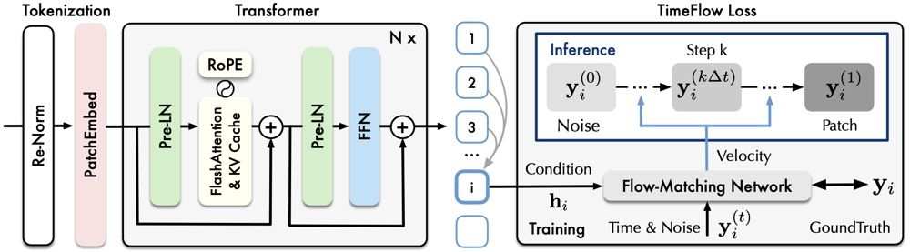

- [amazon/chronos-2](https://huggingface.co/amazon/chronos-2)
- [thuml/sundial-base-128m](https://huggingface.co/thuml/sundial-base-128m)
- [Salesforce/moirai-2.0-R-small](https://huggingface.co/Salesforce/moirai-2.0-R-small)

## **引言：时间序列基础模型概述**

随着**基础模型**（Foundation Model）的兴起，时间序列预测领域也涌现出一批大规模预训练模型。这些模型通过在海量多领域时序数据上一次性预训练，实现了**零样本预测**能力，可在无需针对特定任务微调的情况下直接对新数据进行预测 。相比传统的统计模型（每个序列单独拟合）或早期深度学习模型（针对单一数据集训练），时序基础模型具备更强的泛化能力，能够跨**不同行业场景**（如金融、能源、云计算指标、零售需求等）直接应用 。本文将重点分析亚马逊的 Chronos-2、清华大学 THUML 实验室的 Sundial，以及 Salesforce 研究院的 Moirai 2.0 三个代表性时序大模型，并对比它们的架构设计、创新点、应用场景、开源情况和性能表现。同时，我们也简要介绍其他主流的时序基础模型以提供对比背景。

## **主流时序基础模型概览**

除了本文详述的 Chronos-2、Sundial 和 Moirai 2.0，目前业界和学术界还有多款大型时序模型具备代表性：

- **Google TimesFM**（Time Series Foundation Model）：Google Research 提出的解码器-only模型，受 GPT 架构启发，参数约2亿，在真实数据上预训练了约1000亿时间点 。TimesFM 是早期的通用时序模型之一，在**单变量预测**上零样本表现突出 。
    
- **Amazon Chronos 系列**：Chronos 是亚马逊于2024年推出的时序基础模型家族 。初版 Chronos 将时间序列离散化为**tokens**，采用类语言模型的Transformer结构，通过交叉熵损失训练，并通过采样产生概率预测 。随后改进的 **Chronos-Bolt** 引入**分段直推式**预测，将历史序列切分为多个片段嵌入Encoder，由Decoder直接输出多步的**分位数**预测，从而大幅提升了推理速度和内存效率（比原Chronos快250倍） 。Chronos-Bolt仅支持单变量预测，但与Chronos相比误差降低约5% 。Chronos 系列在 Hugging Face 发布了多个尺寸型号（从千万级参数的Tiny到7亿参数的Large），累积下载量极高（Chronos及Bolt总下载次数超过6亿次） 。
    
- **Datadog TOTO**：由云观测公司Datadog发布的时序基础模型，被称为**Time-series Optimized Transformer**。TOTO训练数据规模近1万亿点，是已发布时序模型中最大的之一 。该模型针对**可观测性指标**（监控数据）进行了优化 ，在工业监控场景具备强大的多序列预测能力。
    
- **Alibaba YingLong**：阿里巴巴提出的大模型，参数规模约3亿 。YingLong 引入了**延迟链式思维**（Delayed Chain-of-Thought）预测框架，与传统直接或递归预测不同，能在长序列预测中取得更好效果。YingLong 在作者设计的内部基准中相比其他基础模型取得显著精度优势 。
    
- **NXAI TiRex**：由Hochreiter团队（NX-AI）开发的**基于增强LSTM**的时序基础模型，参数仅3500万 。尽管体量较小，TiRex 利用改进的 xLSTM 架构在零样本预测中达到当时**全球领先**，在 HuggingFace Gift-Eval 和 Chronos 基准上超越了大量Transformer模型 。TiRex证明了**改良的循环神经网络**在时序大模型中的潜力 。
    
- **其他模型**：此外还有如 **Kairos**（提出自适应泛化的编码器–解码器结构，提供10M/23M/50M等多种规模变体） 、**TabPFN-TS**（将小样本表格预测的TabPFN方法拓展到时序，支持协变量输入） 、**COSMIC**（支持协变量的基础模型）等，以及IBM研究院的 **Granite** 系列时序模型等 。这些模型各具特色，为统一的时序预测提供了不同的技术路线。总体来看，时序大模型领域已经形成**学术界-工业界**共同推动的繁荣生态，各模型在架构、训练数据、损失函数等方面不断创新迭代。

下面，我们重点分析 Chronos-2、Sundial 和 Moirai 2.0 三个模型的设计理念与性能表现。

## **Amazon Chronos-2：从单变量到通用预测**

**模型简介与架构**：Chronos-2 是亚马逊 AWS 于2025年10月发布的新一代**时间序列基础模型** 。它旨在突破此前 Chronos 模型仅支持**单变量**预测的局限，成为可处理**任意维度**预测任务（单变量、多元以及带协变量）的通用模型 。Chronos-2 基于Transformer编码器架构，**参数规模约1.2亿** 。其设计受启发于文本模型 T5 的Encoder，但针对时序数据做了特殊改进 。如**序列分块（patch）嵌入**：先对输入时间序列（包括目标序列和协变量序列）进行归一化处理，加上时间索引和缺失掩码等元特征，然后划分为不重叠的片段patch，再通过残差网络映射为高维嵌入 。Transformer编码器叠加多层后直接输出未来多个patch的**分位数预测**结果 。Chronos-2 每个Transformer层都**交替采用“两种注意力”机制**：一层为时间轴注意力（聚合单个序列内部各patch的信息），下一层为组间注意力（在相同时间步上聚合**所有系列**的跨序列信息） 。这种独特的**Group Attention**机制使模型能够在**上下文学习**（In-Context Learning, ICL）中高效地捕捉不同时间序列之间的依赖关系 。例如，在云监控预测中，不同指标（CPU、内存、I/O）的模式可通过组注意力互相影响，从而提高整体预测准确度 。

**设计理念与技术创新**：Chronos-2 的核心理念是在一个统一模型中实现对**任意结构**预测任务的零样本支持 。为此，它在**架构**和**训练数据**两方面有重要创新 ：(1) **架构上**，提出了**组注意力**来隐式建模未知任务中的变量交互 。相比简单拼接协变量，组注意力在每个时间片上让相关序列/变量的信息交换，大幅增强了对协变量和多序列依赖的建模能力 。(2) **训练数据**方面，为了让模型具备“一专多能”，Chronos-2 构建了**异构的预训练语料**。由于现实中**高质量多元+协变量**数据稀缺，研究者采用**合成数据生成**：先从基元单变量序列随机采样，再人为施加多元相关结构来生成成组序列，并引入关联的协变量 。如此生成的大规模数据（混合真实和合成）涵盖丰富的任务类型，让模型在预训练中学会推理变量交互 。

Chronos-2 没有采用自回归解码器，而是**编码器直接输出未来多个时间步的预测**（即直接多步预测），并使用**分位数损失**（pinball loss）训练从而输出概率分布 。这种设计与Chronos初版的语言建模式解码形成对比：Chronos初版通过采样生成未来序列，而 Chronos-2 直接产生各分位点预测值，**效率更高且易于结合协变量** 。此外，Chronos-2 通过**在批次内实现跨系列的“交叉学习”**，哪怕对于单变量任务，模型也可从同一批其他序列中汲取模式提高准确度 。这在**冷启动**场景（如新建仓库没历史数据）下尤为宝贵：新序列可以与现有成熟序列一起作为上下文输入，Chronos-2 便能通过批内知识迁移给出精准预测 。

**应用场景和性能**：Chronos-2 旨在成为**通用预测引擎**，可服务于各种行业的复杂预测需求。例如：零售场景下结合促销日历等协变量预测销量，能源领域结合天气等已知未来协变量预测负荷，云运维同时预测多种资源指标等 。Chronos-2 发布后在多个权威基准上取得**当前最佳**成绩：在涵盖单变量、多元和协变量任务的综合基准 **fev-bench** 上，Chronos-2 的平均胜率和Skill分均显著领先于其他预训练模型 ；在 **GIFT-Eval** 公共榜单上也登顶预训练模型榜首 （击败此前表现最好的 TimesFM-2.5 和 TiRex 等） 。尤其在包含协变量的任务上，Chronos-2 相比其他基线（如 TabPFN-TS、COSMIC）有**压倒性优势** 。与前代模型相比，Chronos-2 对 Chronos-Bolt 的胜率超过90% 。在**效率**上，Chronos-2 也表现出色：单张NVIDIA A10G GPU每秒可推理超过300条时间序列 ；同时支持CPU部署，利于大规模生产应用 。亚马逊表示Chronos-2 已可直接在生产管道中“即插即用”，极大简化了预测流程 。

**开源情况与社区反响**：Chronos-2 已完全开源，模型权重托管在 Hugging Face（模型ID: amazon/chronos-2）并采用Apache-2.0许可 ；同时提供了配套的Python推理库和在 AWS SageMaker 上部署的教程 。据 Hugging Face 平台统计，Chronos-2 发布仅两周下载量已超过610万次，显示出极高的人气 。Chronos 项目的GitHub仓库（amazon-science/chronos-forecasting）也积累了约4.7k颗星标和550+叉（fork） , 社区讨论活跃。Chronos-2 的推出代表着亚马逊在时序预测基础模型领域的重要里程碑，使其在通用预测能力上达到了行业领先水平 。

## **THUML Sundial：生成式时序基础模型**

**模型简介与架构**：**Sundial** 是清华大学 THUML 实验室于2025年发布的**生成式时间序列基础模型**，其首篇论文被ICML 2025接收为长文（Oral） 。Sundial 强调“原生的”时序建模方式，不依赖离散化token手段就能直接处理连续值序列 。它采用**Decoder-Only**架构（单Transformer解码器），但训练时并非传统自回归概率损失，而是创新性地提出了**TimeFlow Loss**（基于**flow-matching**的流匹配损失） 。简而言之，Sundial 将预测未来视为一个**生成式建模**问题：模型在给定历史序列的条件下，学习一个将随机噪声映射为未来序列分布的变换（类似无参数分布假设的流模型） 。这样模型可以一次生成**多个可能的未来序列样本**，从而不仅能给出点预测或分位数，还能近似任意统计量（如置信区间、完整分布等) 。

**架构设计与创新**：Sundial 的整体架构可以视为一种拓展的**ARMA模型**（自回归–移动平均） ：Transformer 解码器负责**自回归地**提取历史序列的高层特征表示（对应AR部分），而随后基于这些表示的**TimeFlow网络**将随机噪声转换为未来预测（对应MA部分），实现对下一片段分布的生成 。与Chronos初版需要将连续值量化为词典符号不同，Sundial 通过TimeFlow损失直接在连续空间训练Transformer，使其学会对未来的不确定性建模 。这种**非参数生成**方法避免了离散化带来的信息损失与复杂度 。同时，为了确保模型在如此大规模训练下不发生“模式崩溃”（即只输出平均模式），Sundial 的 TimeFlow Loss 通过流匹配技术鼓励模型生成输出的多样性，与扩散模型中的**得分匹配**思想类似 。Sundial 仅对Transformer做了**极简但关键**的改动，例如在解码器中引入了更稳定高速的实现（使用FlashAttention加速长序列注意力计算） 、支持**多patch并行预测**等，从而在保证生成灵活性的同时，达到了**毫秒级**的推理速度 。

**图1：Sundial 模型架构示意。** 输入序列首先经归一化（ReNorm）预处理并划分为固定长度的**patch tokens**，再送入改进的**自回归Transformer**提取历史依赖特征。基于Transformer产生的隐表示，每个时间片段的分布由**TimeFlow**模块通过流匹配方法生成，可采样得到多个可能的未来序列，实现概率预测 。

**预训练语料与规模**：Sundial 的预训练集合称为 **TimeBench**，规模极为庞大——包含了约**1万亿个时间点**的数据 。这些数据主要来源于**真实世界**的时序数据集集合，辅以一部分合成数据，覆盖了不同领域、频率和模式的时间序列 。通过在如此海量且多样的数据上训练，Sundial 获得了空前的模型容量和泛化性能 。Sundial 发布了多个参数规模的模型家族，**base版本**约有**1.28亿参数**（12层Transformer） ，此外还有更小或更大的配置（据开源信息提供了84M参数的Timer模型等） 。Base版以 16 为 patch长度，支持最长 2880 时间步的上下文输入 。模型采用全精度FP32训练以确保稳定性 。值得注意的是，**预测长度**可以弹性变化，Sundial 支持根据需要生成任意步数的未来（示例中96步），也支持一次生成长达720步的未来片段以加速长范围预测 。

**功能与性能**：Sundial 能同时支持**点预测**和**概率预测**的零样本推理 。通过输出足够多的样本序列，用户可以计算均值、分位数、置信区间等感兴趣的统计量 。在精度方面，Sundial 在多个**权威基准**上取得了当时的**SOTA**成绩 ：例如在 Hugging Face **GIFT-Eval** 榜单上获得 MASE 指标第一名 ；在 Time-Series-Library 提供的长短期**多数据集集合**上零样本误差也排名第一 ；并在 FEV-Bench 基准上有领先表现 。更难能可贵的是，Sundial 将推理时间控制在毫秒级：在Apple M1 Pro CPU上，对2880点历史预测16点未来仅需0.51秒 ；利用FlashAttention、KV缓存等优化后，即使预测720点未来也可在同样时间完成 。这种**准实时**的预测速度使其非常适合工业界高频、大批量的预测任务。Sundial 已被集成进 Apache IoTDB 时序数据库中，用于支持物联网场景下的即席预测 。研究者认为，Sundial 所实现的生成式预测范式可以提升模型对未来不确定性的表达能力，从而在实际决策中提高可靠性 。

**开源与社区**：Sundial 模型及代码已在GitHub开源（项目地址: thuml/Sundial，Apache-2.0许可） 。截至目前该仓库获得约179颗星标 。模型权重已上传至 Hugging Face（thuml/sundial-base-128m），累计下载量约10.9万次 。社区用户反馈其零样本性能惊艳，并积极尝试将其用于**供需预测、异常检测**等场景。Sundial 团队也在持续维护，如发布了推理示例Notebook 、提供了更多评估结果和实时讨论渠道等 。

## **Salesforce Moirai 2.0：高效的小型通用预测模型**

**模型简介与演进**：**Moirai 2.0** 是 Salesforce 于2025年8月推出的新一版时间序列基础模型 。名字“Moirai”源自希腊神话命运女神，寓意模型掌控时间演变。相较2024年发布的 Moirai 1.0 系列，2.0版本在架构和训练策略上做了大幅简化与改进，强调“**以更少取得更多**” 。Moirai 2.0**采用纯解码器Transformer架构**，完全舍弃了1.0版使用的编码器-解码器和掩码训练设计 。模型转而使用**单patch输入**和**多token并行输出**的方案，大幅提高了预测效率和稳定性 。输出层采用**分位数预测**：直接生成预设的多个分位点的预测值（如中位数、90%分位等），以同时评估点预测和不确定性 。训练目标也从原来的混合分布（Mixture of Gaussians）转为更简单有效的**多分位数损失**（即多个pinball loss） 。

**架构与训练改进**：Moirai 1.0 暴露的主要问题在于：(1) **Masked Encoder**架构导致训练数据利用率低（大量随机掩码导致有效信息浪费），(2) **多patch输入**限制了模型跨尺度学习能力，(3) **混合分布输出**增加了模型复杂度且实际效果欠佳 。针对这些不足，Moirai 2.0 做出了如下改进：

- **Decoder-only架构**：放弃编码器，使用GPT式的单流Transformer直接对历史序列建模，自回归地生成未来序列的多个时间步 。这样的设计更贴合预测的**自然因果顺序**，并简化了模型结构，利于在更大数据集上扩展训练 。
- **单段输入 & 多步输出**：将过去序列作为一个连续段输入Transformer，并让模型一次性输出整个预测区间（而非逐步迭代生成） 。这提高了**并行化**程度，减少长 horizonte 预测时的误差累积和推理延迟 。
- **分位数损失**：用多分位数回归取代了高斯混合输出。这样模型直接针对各指定分位的误差优化，**稳定且性能更佳** 。实验发现之前的混合分布输出虽然直观但收效甚微 ，而分位数方法取得了更高的准确度。
- **数据质量控制**：加入**数据筛选机制**，在预训练时过滤掉不可预测的或质量差的时间序列（例如纯随机噪声序列），以防止无意义的数据干扰训练 。
- **补全与掩码增强**：对于输入片段，新引入**补丁级别的缺失值嵌入**，明确标记缺失值信息 ；训练中增加**随机掩掉片段**的策略，以提升模型对未来缺失数据和不确定性的鲁棒性 。

这些改变中，**架构精简（仅Decoder）和多量纲分位解码**被证明贡献最大 。通过一系列消融实验，作者量化了各改进的作用：Decoder-only 主干 + 递归多分位解码是提升效果的主要来源 。

**预训练数据与规模**：Moirai 2.0 使用了全新的大规模语料进行预训练。包括公共基准**GIFT-Eval**提供的预训练集和训练集子集（确保无测试泄漏） 、亚马逊公开的**Chronos数据集**的混合数据（利用Chronos论文中的 KernelSynth 方法生成的合成序列） ，以及 **Salesforce 内部的运营数据** 。综合各种来源，Moirai 2.0 共训练了**约3600万条序列** 。假设每条序列长度上千，则总体训练点数级别也相当可观（可能达到百亿级别）。相比1.0，2.0的数据更加多样且针对新架构做了优化。Moirai 2.0 当前主要公布了一个“小型”模型（称为 **R-small**），其**参数量比Moirai 1.0 Large版本减少了约96%** 。根据作者披露，2.0的性能甚至优于1.0的Large模型 。如果Moirai 1.0 Large约有几亿参数级别，那么2.0 R-small估计在**几千万参数**量级（约二三千万） 。Moirai 2.0 极大地压缩了模型规模却提升了精度，实现了“更小更优”。此外，Moirai 2.0 推理速度比1.0 Large提升了**约两倍** ，在相同硬件上显著更快，这对需要实时响应的企业级场景非常重要。

**性能与应用**：在 Salesforce 发起的**GIFT-Eval**权威基准上，Moirai 2.0 达到了当时无测试泄漏模型中的**排名第一**（按MASE指标） 。它的CRPS等指标也与此前SOTA不相上下，但模型规模和速度却占有巨大优势 。与前代模型相比，Moirai 2.0 相对 Moirai 1.0 Large **MASE降低16%**，**CRPS降低13%**，同时**推理加速44%**，参数量只有原来的**4%** 。这意味Moirai 2.0 在更小成本下实现了更高精度，对于**大规模部署**非常有利。Moirai 系列定位于**通用企业预测**，可应用于云容量规划、异常检测、财务风控、能源负荷、零售需求等众多领域 。Salesforce 内部已将其用于云基础设施的容量与告警预测等用例，并取得良好效果 。Moirai 2.0 在各领域均表现稳健，作者报告其在**跨域泛化**和长序列预测方面均表现出色，但也观察到当预测步数很长时效果会有所下降，提示未来可在**长序列建模**上进一步研究 。

**开源及社区**：Salesforce 将 Moirai 2.0 作为学术发布提供了开放获取。Moirai 2.0 (R-small) 模型权重发布在 Hugging Face（ID: Salesforce/moirai-2.0-R-small，CC BY-NC-4.0 协议） 。截至目前该模型下载量约41.6万次 。需要注意由于许可限制，Moirai 2.0 目前主要供研究用途。Moirai 背后的**统一时序Transformer库 Uni2TS** 也在GitHub开放源码（SalesforceAIResearch/uni2ts），提供从预训练、微调到评估的一站式框架 。该库获得了约1.4k颗星标，社区关注度较高 。Moirai 2.0 发布时，Salesforce 官方博客和技术媒体也进行了宣传，强调其**高效性**对企业业务的重要意义 。比如 MarkTechPost 称赞“Moirai 2.0 能在大幅缩减模型规模的同时提高准确率和速度” 。总体而言，Moirai 2.0 的出现展示了在基础模型领域**模型小型化与性能兼顾**的可能性。

## **基准评测与性能对比**

为评估上述模型在**多场景预测**中的表现，我们汇总了公开可用的评测结果，特别关注复杂工业场景的预测精度。以下是关键基准及各模型表现：

- **GIFT-Eval 基准**（General Intent Forecasting Testbed） ：由Salesforce建立的跨领域综合预测榜单，包含来自金融、物联网、零售等23个数据集的测试集合 。评测指标包括 MASE（平均绝对Scaled误差）和 CRPS（连续分位评分）等。
    - _2025年中_榜单显示，**Moirai 2.0** 在无泄漏模型中取得 **MASE 第一** （相对前版本大幅提升16% ），CRPS与最佳相当 。**Sundial** 于2025年5月也曾登顶该榜单的 MASE 指标第一 。**Chronos-2** 在2025年底发布后迅速在该基准的预训练模型中排名**第一** 。可见这三者在不同时间均引领了该权威评测。根据研究报道，Chronos-2 相比此前最佳模型TimesFM-2.5和TiRex在Gift-Eval上显著提升胜率 。

- **fev-bench 基准**（Forecasting Evaluation Benchmark） ：由亚马逊提出的更大规模评测，涵盖96个数据集100个预测任务 。它特别强调**多变量和协变量**预测场景，对模型综合能力要求更高。Chronos-2 在 fev-bench 上以较大优势超越现有所有预训练模型，平均**胜率**和**Skill分**均为最高 。尤其在包含协变量的子集中，Chronos-2 利用ICL获得的提升最大 。Sundial 论文中也报告该模型在 fev-bench（简称FEV）排行榜上名列前茅 。Moirai 2.0 尚未正式报告在fev-bench的结果，但其针对协变量的能力略逊于Chronos-2（因为Moirai主要预测目标序列，对协变量更多依赖显式输入而非深度融合）。
- **Chronos Benchmark II**：亚马逊在Chronos-2技术报告中使用的另一套内部基准，聚焦单变量零样本预测对比。据Chronos-2论文，Chronos-2 在此基准上同样取得**首位** 。TiRex 等模型在部分数据集上接近Chronos-2，但综合性能仍略低。
- **Time-Series-Library基准**：由THU提供的长短期多任务评测库，统计如MSE、MAE等传统误差。Sundial 在该库的零样本 **MSE/MAE** 排名中取得第一 。Chronos-2 和 Moirai 2.0 未直接报告在该库的分数，但它们在各自论文中引用了与其他模型对比的胜率/排名，可推测其表现也属一流水平。
  

**工业复杂场景下的表现**：对**工业界复杂场景**（如云服务器集群指标、供应链多级需求、能耗叠加天气等）的预测精度，是检验模型实用性的关键。从报告和案例来看：

- Chronos-2 在**云计算运营**场景有突出效果。例如预测AWS云实例的 CPU、内存、I/O等协同指标，Chronos-2 能通过组注意力捕捉它们的关联，使预测提前发现瓶颈的能力增强 。又如零售库存场景，Chronos-2 可纳入促销日历、节假日等协变量进行**情境化预测**，显著优于不使用协变量的模型 。这些复杂情境下，Chronos-2 利用其**ICL**机制充分挖掘相关序列间的信息共享，预测精度和可靠性远超传统方法 。
    
- Sundial 的优势在于**概率预测**和**速度**。在工业物联网（如传感器网络）中，决策者往往需要预测的不仅是**点值**，更关心**不确定范围**。Sundial 直接生成未来可能样本，进而提供预测区间，可以更好地评估风险 。其毫秒级响应也适合高频监测场景（如设备故障检测，每秒输出下个时刻的概率分布）。对**非平稳和高噪声**的工业数据，Sundial 的生成式训练有望更稳定地给出合理分布而非发散的点估计。这些都提高了在复杂场景部署时的可靠性。
    
- Moirai 2.0 面向**企业广泛业务**，其突出特点是**高效小模型**易于部署。对于一些工业企业，它可以在**资源有限**的环境（甚至在CPU上）快速运行，同时保持对跨领域数据的良好泛化。Moirai 2.0 在 Salesforce 内部不同业务的数据上都展示出**稳健**的结果 ，这说明它对工业复杂场景也有较好的自适应性。不过，由于参数较少，Moirai 2.0 可能在**非常长周期预测**（如一年以上的逐日预测）上开始表现下降 ，这在需要极长远规划的工业场景中是一个需要关注的点。然而，其精度-速度-规模的折中使其在多数实际场景下**性价比极高** 。  

综合来看，Chronos-2、Sundial、Moirai 2.0 均代表了2025年前后时序基础模型的最新水平，各自侧重有所不同：Chronos-2 凭借**跨序列注意力**在多元协变量场景拔得头筹，Sundial 以**生成式多样性**和**极高性能**在多个榜单封王，Moirai 2.0 则以**小而强**的设计实现了实用性与准确度的平衡。下一节我们将对它们的主要参数和特性进行横向汇总比较。

## **模型参数与特性横向对比**

下表汇总了 Chronos-2、Sundial Base、Moirai 2.0 R-small 三个模型的关键参数和特性，并进行对比：

|**模型**|**发布机构（时间）**|**参数量**|**架构类型**|**上下文长度 & 输出长度**|**训练数据规模**|**主要创新与特性**|**开源及流行度**|
|---|---|---|---|---|---|---|---|
|**Chronos-2**|Amazon AWS（2025.10）|1.20亿|Encoder-Only Transformer（改进T5编码器）|Context最长8192步，预测最长1024步|大规模真实+**合成多元**数据（含协变量）|– **组注意力机制**：交替“时间注意力”和“组注意力”处理**多序列依赖** – **In-Context Learning**：批内实现**跨序列信息共享**，支持任意目标和协变量零样本预测 – **直接多步分位数预测**：Encoder直接输出未来各步多个分位值，提高效率和稳定性|Hugging Face开源（Apache-2.0）下载>610万 ；GitHub ⭐4.7k ；提供推理库与AWS部署方案|
|**Sundial (Base)**|THU ML (ICML’25)|1.28亿|Decoder-Only Transformer（GPT式）|支持最长2880步输入，灵活输出任意步数（实测720步以内高效）|**TimeBench** 数据集，含约1万亿时间点（多领域真实+部分合成）|– **TimeFlow Loss**：基于流匹配的**生成式损失**，无需离散化即可训练Transformer生成未来分布 – **多样本生成**：一次生成未来的**多个样本序列**，获取任意统计量，提高对不确定性的洞察 – **高效推理优化**：引入FlashAttention、KV缓存、Multi-patch并行解码等实现毫秒级预测|Hugging Face开源（Apache-2.0）下载≈109k ；GitHub ⭐179 ；ICML’25长文，方案集成进Apache IoTDB|
|**Moirai 2.0 (R-small)**|Salesforce AI (2025.08)|**≈2500万**(_较1.0 Large减96%_)|Decoder-Only Transformer（无Encoder）|典型上下文长度约1000~1680（可变） ；单次输出整个预测窗口（如100步）|新语料36M序列（Gift-Eval公开数据 + Chronos混合合成 + 内部业务数据）|– **架构瘦身**：移除编码器，**单Transformer**直接多步预测，提高训练数据利用率和扩展性 – **Quantile预测**：采用**多分位数损失**代替混合分布，简化模型同时提升概率预测精度 – **高效小模型**：参数极小却性能持平甚至超越大模型，**速度提升44%**，适合部署到资源受限环境|Hugging Face开放权重（研究许可）下载≈41.6万 ；GitHub (Uni2TS库) ⭐1.4k ；Salesforce内部验证多场景有效，GIFT-Eval MASE排名#1|

_表注：_ 上述Moirai 2.0参数量为估计值，实际未公开精确数字；Chronos-2提供Small版(2800万参数)适用于低资源环境 ；Sundial另有不同尺寸模型（Timer等）供不同需求。

  
从表中可以看出，这三种模型在架构上各有侧重：Chronos-2 引入Encoder端的组注意力适合**多序列协同**，Sundial 坚持Decoder端生成以获得**分布灵活性**，Moirai 2.0 则走向**极简高效**架构。参数规模方面，Chronos-2和Sundial均在亿级，Moirai 2.0仅几千万但表现不输甚至更优。训练数据上，三者都利用了**极大规模数据**，其中Sundial以1e12点称冠，Chronos-2和Moirai通过合成和汇集也达到了相当规模级别。功能上，三者都支持**零样本预测**，Chronos-2擅长吸收协变量信息，Sundial能给出完整概率分布，Moirai 2.0则追求轻量部署和工程实用。开源社区反响表明Chronos-2商用潜力大（下载、星标遥遥领先），Sundial学术影响力高（顶会发表），Moirai 2.0则在实际业务中验证价值并引领了小模型趋势。

## **结语**

Chronos-2、Sundial 和 Moirai 2.0 代表了时间序列预测基础模型领域的最新进展，分别从不同角度推进了技术边界。Chronos-2 展示了**融合上下文学习**与**多序列注意力**在复杂预测任务中的威力，在云服务、零售等工业场景实现了真正的通用零样本预测 。Sundial 则以**生成式方法**颠覆了传统预测范式，通过流匹配训练让模型能够直观地给出未来不确定性的全景，为决策提供了更丰富的信息 。Moirai 2.0 则证明了**模型瘦身**并不一定以牺牲精度为代价，精巧的架构改进和训练策略可以让一个小模型同样胜任跨领域的预测任务 。在实际应用中，用户可根据需求选择合适的模型：需要多元协同、高准确率的可考虑Chronos-2，追求速度、概率输出的可选Sundial，而资源有限又需稳健性能的场景下Moirai 2.0 是理想之选。

面向未来，时序基础模型仍有诸多挑战和机遇。例如**长序列依赖**建模、**罕见事件**和**结构化先验**的融入、不同模态（如文本、图像）信息对预测的辅助等都是值得探索的方向 。可以预见，随着更多开放基准（如GIFT-Eval、FEV-Bench）推动公平竞赛，以及工业界不断涌现新需求，时间序列大模型将持续演进，成为各行业决策支持的重要基石。

**参考文献：**

- Ansari, A.F. _et al._ (2025). _Chronos-2: From Univariate to Universal Forecasting_ – Amazon Science技术报告及论文.
- Liu, Y. _et al._ (2025). _Sundial: A Family of Highly Capable Time Series Foundation Models_. ICML 2025.
- Liu, C. _et al._ (2025). _Moirai 2.0: When less is more for time series forecasting_ – Salesforce AI研究论文.
- Hugging Face模型卡 & 官方博客：Chronos-2 、Sundial 、Moirai 2.0 等.
- GitHub仓库：Chronos (amazon-science) 、Sundial (thuml) 、Uni2TS (SalesforceAIResearch)