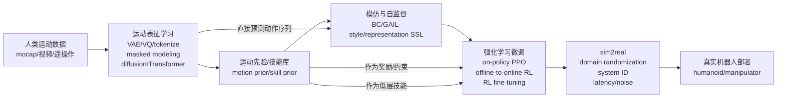
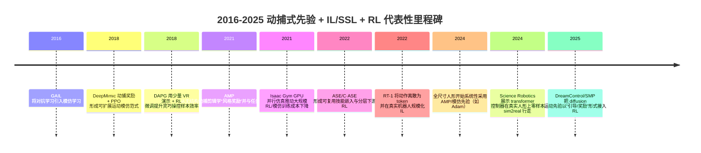

## 执行摘要

过去十年里，你提出的“以关节驱动参数为核心表征、用动补式数据做自监督预训练，再用强化学习微调，尽量弱化/替代传统控制算法”的方向，不仅有人在做，而且已经形成了多条成熟技术路线：其一是“动捕参考轨迹 作为奖励/判别器监督 + 强化学习（RL）”的全身运动模仿（motion imitation）体系，从图形学角色（character）一路发展到真人尺寸人形机器人（humanoid）落地；其二是“把动作离散化/标记化（tokenize）成类似语言 token 的序列建模”，用 Transformer、扩散模型（diffusion）或掩码建模（masked modeling）学动作先验，然后在机器人上用模仿学习（IL）与 RL 做适配与强化；其三是“分层（hierarchical）技能先验”，先用无监督/弱监督把大规模运动数据压成可控的技能空间，再让上层策略用 RL 在技能空间里解决任务。上述路线的共同点是：把“自然动作（naturalistic motion）/可行运动（physically feasible motion）”变成可学习的先验或可复用的奖励，从而显著降低任务奖励工程、探索难度与样本复杂度，而不是完全依赖手工控制器。citeturn22view0turn25view0turn28view1turn34view2turn31view0

两条近年非常贴近你设想的“强力出奇迹”实现形态是：  
一是以“参考运动→PD 目标关节角→力矩”的接口，把策略网络输出当作电机层的目标（position/velocity setpoints），用 PD（或其变体）在几百 Hz–kHz 上闭环执行，学习侧在几十 Hz 上推理与更新，这种“学习策略 + 经典低层伺服”的混合，已在 DeepMimic、AMP 体系及其机器人化实现中反复验证。citeturn22view0turn25view0turn30view1turn34view2  
二是把“动作序列当 token 序列”做大规模序列建模（例如 RT-1 的离散动作 bins、Gato 的统一 token、多种离线 RL Transformer），再在真实机器人或多机器人数据上微调适配动作空间与观测空间。citeturn37view1turn9search2turn9search0turn9search13turn10search1

总体判断：你提出的“放弃所有控制算法”在工程上仍不常见，因为高频稳定性、硬件安全、接触不确定性与实时性让“纯端到端力矩控制”成本很高；但“把传统控制算法缩到最薄（例如仅保留 PD/安全限幅/状态估计），其余交给可规模化学习”已经是主流前沿范式之一，尤其在大规模仿真（GPU 并行）推动下。citeturn8search0turn34view2turn22view0turn30view1

## 范围、纳入标准与检索方法

本综述覆盖 2016-02-28 至 2026-02-28（近十年）的学术与工业高质量材料，主题限定为“动捕式运动先验/标记化动作预训练（motion priors / tokenized motion）+ 模仿/自监督 + 强化学习”在两类机器人控制中的结合：人形（humanoids，全身/下肢为主，含全身交互）与操作臂/灵巧手（manipulators/dexterous hands，含移动操作）。citeturn19search0turn22view0turn31view0turn37view1

纳入标准：  
一是优先收录同行评审会议/期刊（如 CoRL、RSS、NeurIPS、ICLR、ACM TOG、Science Robotics 等）与被广泛引用/复现的 arXiv 预印本；二是包含能代表产业路线的官方白皮书/项目页（例如 entity["company","NVIDIA","gpu vendor, us"] 的 Isaac Gym/Isaac Lab 生态，或头部人形公司公开技术材料），但对新闻解读类材料仅作补充，不作为关键结论唯一依据；三是只要工作在机器人控制链条上“实质使用”了（a）运动数据先验/动作标记化（b）IL/自监督（c）RL（含离线到在线、模仿到强化、或判别式模仿+RL），就可纳入，即便其最初来自图形学角色控制，只要对机器人控制体系产生直接方法学影响。citeturn8search0turn8search1turn22view0turn25view0turn34view2

检索策略：先用英文检索词（例如 “humanoid motion imitation adversarial motion priors PPO PD target joint angles”, “tokenized action robot manipulation behavior transformer VQ”, “offline-to-online RL demonstrations AWAC RLPD” 等）在 arXiv、OpenReview、PMLR、ACM DL、Science/AAAS、机构项目页与代码仓库中交叉验证；当出现信息冲突或需要工程细节（动作接口、频率、PD 等）时，以论文 PDF 或官方文档为准。citeturn22view0turn25view0turn34view2turn37view1turn8search13

## 方法谱系与分类框架

### 总体分类法

可以把“动捕式预训练 → IL/自监督 → RL 微调/强化 → sim2real”看成一个可组合的控制栈；差异主要发生在三处：  
一是“运动先验如何表示”：连续轨迹（joint/pose sequences）、离散 token（VQ/VAE/离散 bins）、或生成式先验（diffusion/Transformer 生成）；二是“如何把先验作用到控制上”：作为奖励（reward shaping/learned reward）、作为初始化（policy init / latent skill policy）、作为约束（KL/energy/score distillation）、或直接生成动作（policy as generator）；三是“控制接口与层级”：低层是力矩（torque）还是 PD 目标（position/velocity targets），高层是技能 latent、子目标（subgoals）还是端到端从像素到动作。citeturn22view0turn25view0turn28view0turn34view2turn37view1

下面用两个 mermaid 图把常见架构与里程碑串起来。

image_group{"layout":"carousel","aspect_ratio":"16:9","query":["motion capture suit reflective markers","humanoid robot walking reinforcement learning","dexterous robot hand manipulation","robot imitation learning teleoperation VR"],"num_per_query":1}

### 关键维度的“术语对照”

运动 token（motion tokens）：把连续关节/姿态序列离散化为有限码本，或把每个动作维度分箱成离散符号，使得可用语言模型式的序列建模（autoregressive / masked LM）来学习动作分布与长期依赖。RT-1 的动作分箱就是一种工程化 tokenization；在更强的离散化方向上，VQ-BeT 等把动作压到离散码本以做多模态/多峰行为克隆。citeturn37view1turn3search1turn3search2

动捕式预训练（mocap-style pretraining）：不一定必须穿标记点动捕服；更广义上包括 VR 遥操作、kinesthetic teaching、甚至纯视觉“人类手部/全身玩耍视频”，只要能得到（显式或隐式）运动轨迹并作为先验学习的源数据。RoboTurk、BC-Z、MimicPlay 属于这一广义动捕式数据范畴。citeturn12search4turn18view0turn14search0

“放弃控制算法”的现实折中：大多数落地系统仍保留最低限度的高频伺服（PD/电流环/安全限幅），学习算法主导策略层与中低层目标生成，这种做法在 DeepMimic/AMP 系、以及真实人形行走策略中反复出现；例如 Digit 的学习控制器输出 PD setpoints（并可预测部分 PD gains），硬件侧仍以 kHz PD 闭环执行。citeturn22view0turn25view0turn34view2

## 关键文献注释式书目

下面给出 36 篇/项代表性工作（大体按“方法谱系”排序），每条包含：方法与数据、平台、状态/动作与控制接口（若文中明确）、主要结果、优缺点；每条末尾引用即为可点击链接。

### 动捕式运动模仿与对抗式运动先验

**B01 Generative Adversarial Imitation Learning（GAIL, 2016）**：提出把模仿学习表述为对抗训练，通过判别器学习“像专家”的奖励，进而用 RL 直接优化策略；为后续“用判别器当运动风格奖励”的 AMP/ASE 系奠基。数据是专家轨迹（状态-动作）；平台任务不限定机器人，强调高维连续控制可用。优点是避免显式逆强化学习内环；局限是训练稳定性与对演示质量敏感，并且在“只有状态、无动作”的动捕场景需要扩展到 state-only 版本。citeturn19search0turn25view2

**B02 DeepMimic（ACM TOG / SIGGRAPH, 2018）**：把动捕参考动作转成模仿奖励，与任务奖励组合，用 PPO 学高维运动技能；动作接口明确为“每关节 PD 目标角”，再由 PD 产生力矩；状态包含各关节相对位姿/速度及相位变量，策略 30Hz。主要贡献在于证明“动捕式奖励 + 现代深度 RL”可以覆盖从走跑到翻转踢打等高动态技能，并支持多技能切换。优点是概念与工程链条清晰；局限是依赖高质量参考动作与奖励项设计，且大多在仿真角色上验证，迁移到真实机器人需要额外 sim2real。citeturn22view0

**B03 Neural Probabilistic Motor Primitives（NPMPS, 2018/后续会议版本）**：提出把大量专家策略/行为压缩到带潜变量瓶颈的“运动原语模块”，可离线训练并实现一招式模仿与下游任务复用，属于“先学可复用低层运动空间，再做任务 RL”的早期形态。论文强调离线压缩与可泛化模仿；具体控制接口依赖其仿真 humanoid 设置（文中不总是逐项列出）。优点是把“技能库”变成可复用模块；局限是技能覆盖与可控性受训练集与潜空间结构影响。citeturn6search0turn6search4

**B04 AMP: Adversarial Motion Priors（ACM TOG, 2021）**：把无结构动捕剪辑（unstructured motion clips）训练成“风格奖励判别器”，并与任务奖励线性组合，用 PPO 训练策略；关键工程细节是动作依旧是“关节 PD 目标位置（含球关节指数映射）”，策略 30Hz、物理仿真 1.2kHz。结果展示无需显式片段选择/相位同步即可产生风格可控且可组合的运动。优点是显著降低“手工设计模仿误差度量”的负担；局限是对抗训练仍可能不稳、风格奖励与任务奖励权重需要调参，且在机器人落地时仍需系统级 sim2real。citeturn25view0turn25view1

**B05 Isaac Gym（NeurIPS 数据集与基准, 2021）**：提出 GPU 上端到端物理仿真与策略训练的高吞吐平台，使得动捕模仿+RL、技能库预训练等需要海量采样的工作在单机/少量 GPU 上可行，成为 AMP/ASE/许多人形 RL 现实可用的算力底座。优点是把“规模”变成常规变量；局限是仿真精度、接触建模与真实硬件差异仍需通过域随机化/高保真验证器弥补。citeturn8search0turn8search8

**B06 ASE: Adversarial Skill Embeddings（ACM TOG, 2022）**：在 AMP 思路上进一步做“可复用技能嵌入（skill embeddings）”，结合对抗式模仿与无监督 RL 目标学习大量技能，再在下游通过高层策略在 latent 技能空间做任务；动作接口仍是关节 PD 目标旋转，文中给出具体 state/action 维度（例如动作 31D），并使用 PPO。优点是把动捕式先验变成跨任务复用的“技能动作空间”；局限是技能可解释性、下游高层探索与技能切换平滑性仍需额外机制。citeturn28view0turn28view1turn27view0

**B07 C·ASE（SIGGRAPH Asia, 2023）**：对 ASE 做“条件化”以提高在异质技能数据上的稳定性与可控性，目标是让技能子集更一致、条件化生成更好控制。其价值在于把大规模技能学习从“一个大混合体”变成可分块管理的结构。局限是依然主要在仿真角色体系论证，机器人化落地需要进一步对接硬件与感知。citeturn8search2turn8search6turn8search10

### 人形机器人侧的“动捕/先验 + RL + sim2real”落地与基准

**B08 Whole-body Humanoid Robot Locomotion with Human Reference（Adam, 2024）**：在全尺寸人形 Adam 上系统化实现“基于 AMP 的对抗运动先验 + PPO”，并明确动作是 25 维“各驱动关节的 PD 位置调整”，观测 91 维，训练在 4096 并行 Isaac Gym 环境。论文宣称实现带“heel-to-toe”等人类特征的步态。优点是把 AMP 系推进到全尺寸电机驱动人形并报告观测/动作工程细节；局限是仍以行走/跑步类为主，且依赖精心构建的随机化与验证流程。citeturn29view0turn30view1turn30view2

**B09 Mimicking-Bench（2024）**：提出“人形-场景交互（humanoid-scene interaction）”的系统性基准，覆盖任务、物体形状泛化、真实/合成人类交互参考，并把 retargeting、tracking、IL、组合方法纳入统一评测管线。它的意义在于把“动捕模仿不仅是行走”，扩展到家庭场景交互并衡量泛化。局限是基准仍受限于仿真资产与交互建模，且不同方法的可比性依赖统一实现细节。citeturn19search1turn19search5turn19search17

**B10 Humanoid Parkour Learning（CoRL 2024）**：强调无需 motion prior 的端到端视觉全身控制 parkour，并展示跨障碍的技能组合与室内外测试；在本综述中，它提供了“对照组”：当没有动捕先验时，需要更复杂的感知与训练技巧来覆盖高难度技能。局限是对先验/标记化运动的利用较少，因此与“动捕式预训练”结合主要体现在可迁移的框架与下游移动操作潜力。citeturn35view0

**B11 Real-world humanoid locomotion with reinforcement learning（Science Robotics, 2024）**：在 Digit 人形上提出因果 Transformer 控制器，用大规模仿真 RL 训练并零样本部署到真实机器人；关键工程点是动作空间由“16 个驱动关节的 PD setpoints + 8 个腿关节的预测 PD gains”组成，部署时策略 50Hz、关节 PD 1kHz，并在训练中结合 teacher imitation 与 RL。优点是展示“序列建模/动作历史 token”可作为适应机制，并把 sim2real 做到较强鲁棒；局限是其“先验”更多来自仿真随机化与教师策略，而非外部动捕数据。citeturn33view0turn34view2turn34view3

**B12 Learning Getting-Up Policies for Real-World Humanoid Robots（2025）**：关注跌倒起身（getting-up）这一接触复杂、奖励稀疏的关键技能，提出两阶段课程（先发现轨迹、再变为可部署慢而稳动作），并宣称在真实 Unitree G1 上实现起身。它补足了“仅会走不够用”的现实短板。局限是高度依赖仿真接触几何与随机化质量，且不同地形/跌倒姿态覆盖仍是开放问题。citeturn17search2turn17search11turn17search22

**B13 DreamControl（2025）**：非常贴近“用大规模人类运动先验引导 RL 学全身任务”的构想：先用扩散先验生成/采样人类运动并 retarget 到机器人，再在仿真中用 RL 学跟踪与完成任务；论文明确动作空间为 29D，其中 27D 是 G1 身体目标关节角，手部用开合标量控制，并由 PD 将目标角转成力矩。优点是把“人类 motion diffusion prior → RL 低层鲁棒控制 → sim2real”串成闭环；局限是对手部与灵巧操作仍做了简化（如离散开合），且整体系统复杂度高。citeturn31view0turn32view3turn32view0

**B14 SMP: Score-Matching Motion Priors（2025）**：提出把预训练运动扩散模型通过 score distillation 等方式变成“可复用的运动先验奖励”，避免对抗判别器必须与每个新策略共同训练、并减少保留原始参考动作数据的需求。它代表了从“对抗式先验”向“可冻结、可组合的扩散先验奖励”的迁移。局限是实现细节与稳定性高度依赖扩散模型质量、SDS 目标与物理可行性耦合方式。citeturn19search3turn19search7

**B15 ADD（2025）**：针对 motion tracking 中多目标权重难调的问题，提出对抗式多目标优化，让判别器帮助自动平衡多个跟踪/物理目标以减少奖励工程；它的重要性在于让“模仿奖励”更少手调。局限是对抗机制带来额外不稳定性与调参维度，且主要仍在仿真角色体系评估。citeturn11search8turn11search3

**B16 MimicKit（2025）**：以开源框架形式把 DeepMimic、AMP、ADD 等运动模仿与 RL 算法工程化整合，降低复现门槛并推动标准化对比；对研究者而言，它相当于“动捕模仿+RL”的可复用实验底盘。局限是框架本身不解决 sim2real 与硬件细节，迁移到真实机器人仍需大量系统工程。citeturn11search9turn11search16turn7search11

### 操作臂与灵巧手：演示/自监督 + RL 微调、以及动作 token 化

**B17 Demonstration Augmented Policy Gradient（DAPG, RSS 2018）**：用少量 VR 人类演示先做行为克隆初始化，再在 policy gradient 中加入“贴近演示”的附加梯度项实现 RL 微调；文中明确环境观测包含手关节角、物体位姿等，动作是“期望的手关节位置（desired joint positions）”。其贡献是把“演示先验”变成可用于探索与鲁棒性的强偏置，从而把复杂灵巧操控的样本量降到接近可行。局限是需要高质量演示与任务定义，且真实硬件部署仍需 sim2real 与安全保障。citeturn21view0turn21view2turn20view0

**B18 Solving Rubik’s Cube with a Robot Hand（2019）**：展示纯仿真训练+域随机化（ADR）实现复杂灵巧操控 sim2real；虽不以动捕预训练为主，但它是“规模化 RL + sim2real”在灵巧手上的里程碑，并强化了“控制接口+随机化+系统工程”对落地的重要性。局限是训练成本高、任务专用性强，泛化到更开放的操作仍困难。citeturn6search2turn8search7turn8search11

**B19 RoboTurk（IROS 2019）**：提出通过远程遥操作规模化采集真实机器人长时程操作数据，强调相较低信噪的自监督采集，遥操作能获得更高质量策略学习数据；它为后续“动捕式数据（广义）→IL/离线RL”提供数据基础。局限是数据采集成本仍高、标注与安全流程复杂。citeturn12search4turn12search16

**B20 D4RL（2020）**：离线 RL 基准数据集与评测协议，覆盖包括机器人操作在内的多个域，推动“从静态轨迹数据学策略”的系统性研究；在本主题里，它是“把动作轨迹当数据、做自监督/序列建模/离线RL”的关键公共底座之一。局限是与真实机器人分布差异、以及离线到在线迁移仍是难点。citeturn12search1turn12search13

**B21 AWAC（2020）**：提出把离线数据（含演示/既有经验）用于加速在线 RL 微调，解决“先用数据学一个能动的初始策略，再用少量在线交互变强”的常见需求；论文展示在模拟与真实机器人任务上可行。局限是对数据质量、行为策略分布与价值估计偏差仍敏感。citeturn12search2turn12search10turn12search6

**B22 SPiRL（CoRL 2020）**：代表“技能先验（skill prior）+ 下游 RL”的分层路线：先从离线经验学习技能潜空间与先验，再把先验融入最大熵 RL 以提升探索效率与迁移。优点是把“动作先验”显式参数化为可复用的潜变量分布；局限是潜空间的表达与可控性直接决定下游上限，且不同机器人/任务的对齐并不自动。citeturn6search1turn6search5turn6search9

**B23 RoboMimic / What Matters in Learning from Offline Human Demonstrations（CoRL 2021/后续 PMLR 版本）**：系统比较多种离线学习算法在模拟与真实多阶段操作任务、以及不同质量的人类遥操作数据上的表现，并提出数据与算法选择的关键因素。其意义在于把“从人类演示数据学控制”做成可复现研究对象。局限是结论随数据集与任务族变化而变化，且从离线到在线进一步提升仍需额外机制（如 AWAC/RLPD 风格）。citeturn5search15turn5search19turn5search7

**B24 Decision Transformer（2021）**：把 RL 视为条件序列建模（按期望回报条件生成动作），代表“token 化轨迹 + Transformer”在离线 RL 的核心范式；虽然不是专为机器人，但对后续 RoboCat、VLA 及动作 token 化控制影响很大。局限是对数据覆盖与条件对齐敏感，且“指定回报=实际达成回报”的可控性是长期问题。citeturn9search0turn9search4turn9search8

**B25 Trajectory Transformer（NeurIPS 2021）**：用 Transformer 学轨迹分布并做规划/决策，推动“把轨迹当语言”的一类方法；对机器人而言，它提供了除传统 actor-critic 外的“序列模型决策”替代路径。局限是计算与部署实时性、以及在高频控制闭环中的工程化仍具挑战。citeturn9search13

**B26 BC-Z（CoRL 2021）**：在真实机器人上做大规模交互式模仿学习，数据来自 VR 遥操作与共享自治纠错；动作空间明确为“末端 6DoF 位姿 + 夹爪 1DoF”，并报告零样本新任务平均成功率 44%。在本主题中，它是“广义动捕式人类动作数据 → 大规模 IL → 泛化”的标杆。局限是主要是操作臂级别动作（非力矩级），且对长期任务仍依赖任务分解与更大数据。citeturn18view0

**B27 RT-1（2022）**：将真实机器人控制规模化并显式做“动作 tokenization”：把 7 维手臂动作、3 维底盘动作及模式选择离散到 256 bins，Transformer 输出离散动作 token；报告在 700+ 语言指令、130k 演示轨迹上训练并在真实厨房评测。优点是把“动作=token”与实时控制工程（如 TokenLearner、推理频率）结合；局限是仍以模仿学习为主，RL 微调与安全约束需要系统级集成。citeturn37view1turn38view0turn6search7

**B28 Gato（2022）**：提出统一 token 序列模型，跨文本、图像、控制等多模态与多任务，说明“同一 Transformer 输出可包含关节力矩等控制 token”。对机器人控制而言，它强化了“动作 token 与序列上下文”这一范式的可行性。局限是机器人任务覆盖与严格评测相对有限，且把此类大模型稳定部署到高频闭环仍具工程挑战。citeturn9search2turn9search6

**B29 Behavior Transformers（BeT, 2022）**：面向模仿学习中的多峰动作分布问题，通过把行为模式离散化并用 Transformer 学“模式→动作”的映射，强调在多解任务中提升行为多样性与成功率；它是“动作离散 token + IL”的代表。局限是离散化粒度与码本质量直接影响可控性与精度。citeturn4search2turn37view1

**B30 Diffusion Policy（2023）**：把机器人动作序列建模为扩散生成过程，用条件扩散生成动作轨迹，强化对长时程一致性与多模态的建模；在本主题里，它代表“生成式动作先验（diffusion）→ IL 初始化/策略表示”，并成为后续人形 DreamControl 等工作的参考系。局限是推理成本与实时控制频率、以及与 RL 微调结合时的稳定性（例如如何把扩散模型当策略还是当先验/约束）。citeturn2search3turn3search3

**B31 RT-2（CoRL 2023）**：把动作表示成文本 token 并与互联网规模视觉-语言预训练结合，形成 VLA（vision-language-action）范式，显著提升新物体/新指令泛化并展示链式推理在机器人控制中的作用。局限是动作文本化的分辨率、与低层控制接口（力矩/PD/末端位姿）之间仍需要工程桥接。citeturn9search3turn9search7turn9search11

**B32 RoboCat（2023/后续 ICLR 展示）**：以 decision-transformer 风格的视觉目标条件策略跨多机器人多任务学习，并强调自举式数据生成迭代（self-improving loop）与少样本适配。它代表“序列模型 + 多 embodiment 数据 + 迭代扩容”的产业级路线。局限是评测与复现门槛高、对数据与系统工程依赖极强。citeturn10search3turn10search15turn10search7turn10search11

**B33 MimicPlay（CoRL 2023）**：利用人类“自由玩耍”视频学习高层潜计划（latent plans），再用少量遥操作演示训练低层视觉运动控制，体现“纯人类动作/交互视频 → 结构化先验 → 机器人 IL”的路线。局限是跨形态对齐（human→robot）与从视频到可执行控制之间的信息缺口仍大。citeturn14search0turn14search3

**B34 Open X-Embodiment / RT-X（2023/ICRA 2024 版本）**：提供跨 22 种机器人 embodiment 的百万级真实轨迹与标准化格式，并给出可适配模型，推动“跨机器人预训练→下游快速适配”的基础设施化。局限是数据异质性带来的动作/观测对齐难题仍需要模型与接口设计。citeturn10search0turn10search8turn10search12

**B35 Octo（RSS 2024 公开版）**：在 Open X-Embodiment 上训练通用操作策略并强调快速微调到新传感器/新动作空间，论文与项目页把“预训练大策略作为初始化”明确工程化。局限是离线 IL 的上限、以及与 RL 在线微调的结合策略仍在探索期。citeturn10search1turn10search5turn10search9

**B36 VQ-BeT（2024）**：把动作通过 VQ（vector quantization）离散化为码本 token，再用 Transformer 建模并引入选择/组合机制以提升多模态模仿学习效果，属于“更贴近你设想的离散动作字典”。局限是码本学习与任务分布强相关，且离散化误差在精细操控上需要补偿机制。citeturn3search1turn3search8

**B37 Masked Generative Policy（2025）**：把机器人控制做成类似 BERT 的掩码生成（masked generation），在动作 token 空间通过填空式生成实现条件控制，体现“动作 token + 自监督/生成式预训练”向控制的迁移。局限是掩码策略与实时闭环控制的接口设计、以及在高维连续动作上的细粒度精度。citeturn3search2turn3search3

**B38 BEAST（2025）**：以分层 token 化与更强的序列建模来学习“通用行为 token”，强调可扩展的动作用语并在多任务模仿/控制中验证；在本主题中，它代表动作标记化进一步系统化的一步。局限是与真实硬件/高频控制对接仍需额外工程与安全约束。citeturn0search4

**B39 VQ-VLA（ICCV 2025）**：专注于把动作做 VQ token 以提升 VLA 的可控性与稳定性，体现 VQ/tokenization 在“语言-动作统一格式”中的关键作用。局限同样在于离散动作与连续控制精度之间的张力，以及码本跨 embodiment 泛化。citeturn3search6

## 对比表与综合分析

下表对上述代表性工作做统一维度对齐（B 编号对应上节条目；“控制接口”若论文未明确则标为“未说明/依赖实现”）。表中信息来自各论文与官方项目文档。citeturn22view0turn25view0turn30view1turn34view2turn37view1turn31view0turn10search1turn3search1

| 编号 | 年份 | 主要方向 | 运动数据类型 | 预训练/先验方法 | IL/自监督 | RL/微调 | sim/real | 机器人类型 | 控制接口 | 关键结果（概述） |
|---|---:|---|---|---|---|---|---|---|---|---|
| B01 | 2016 | 对抗模仿基础 | 专家轨迹 | 判别器学奖励 | GAIL | 需要 RL 优化 | 通用 | 通用 | 未限定 | 奠基“判别器=可学习奖励” |
| B02 | 2018 | 全身动捕模仿+RL | mocap 参考姿态 | 模仿奖励 + PPO | 可视作模仿奖励 | PPO | sim | humanoid(仿真) | 关节 PD 目标角→力矩 | 覆盖多技能高动态模仿 |
| B03 | 2018 | 技能压缩/原语 | 专家策略/轨迹 | 潜变量 motor primitive | 离线压缩 | 下游可做 RL | sim | humanoid(仿真) | 依赖实现 | 一次训练后可复用技能空间 |
| B04 | 2018 | 演示+RL灵巧操控 | VR 演示 | BC 初始化 | BC | policy gradient 微调 | sim | 灵巧手(仿真) | 期望关节位置 | 样本复杂度显著下降 |
| B05 | 2019 | sim2real 灵巧手 | 仿真交互 | 主要靠随机化 | 少量/无演示 | RL + ADR | sim→real | 灵巧手(真实) | 未逐项统一 | 复杂任务 sim2real 里程碑 |
| B06 | 2019 | 数据采集平台 | 遥操作轨迹 | 数据规模化 | IL 数据源 | 可供离线/在线 | real | 操作臂 | 依赖任务 | 真实长时程演示数据扩容 |
| B07 | 2020 | 离线RL基准 | 多域轨迹 | — | — | 离线RL评测 | sim | 多类 | — | 推动“从数据学控制” |
| B08 | 2020 | 离线到在线 RL | 演示/经验 | — | — | AWAC O2O | sim+real | 操作臂/灵巧手 | 依赖实现 | 少在线交互即可提升 |
| B09 | 2020 | 技能先验分层RL | 经验轨迹 | skill prior | 自监督潜空间 | 下游 max-ent RL | sim | 操作/导航 | 依赖实现 | 提升探索与迁移效率 |
| B10 | 2021 | 对抗运动先验 | 无结构 mocap clips | AMP 风格奖励 | 对抗式模仿 | PPO | sim | humanoid(仿真) | 关节 PD 目标位置 | 风格可控、减少手工跟踪度量 |
| B11 | 2021 | GPU并行仿真平台 | — | Isaac Gym | — | 支撑大规模RL | sim | 多类 | — | 大幅加速训练吞吐 |
| B12 | 2021 | 离线人类演示学习 | 遥操作(含真实) | — | IL/离线学习对比 | 可扩展到 O2O | sim+real | 操作臂 | 依赖环境 | 明确“离线演示学习关键因素” |
| B13 | 2021 | 序列模型离线RL | 轨迹序列 | Transformer | 监督序列建模 | 离线RL范式 | sim | 通用 | token化动作 | 条件生成动作（按回报） |
| B14 | 2021 | 轨迹Transformer | 轨迹序列 | Transformer | 序列建模 | 离线规划/控制 | sim | 通用 | token/连续混合 | 轨迹分布建模驱动决策 |
| B15 | 2021 | 大规模 IL 泛化 | VR遥操作+纠错 | — | 多任务IL | 非核心 | real | 操作臂 | 末端6DoF+夹爪 | 24个新任务零样本平均44% |
| B16 | 2022 | 可复用技能嵌入 | mocap clips | 对抗+无监督RL | 内在目标 | PPO | sim | humanoid(仿真) | PD 目标旋转 | 一个低层模型复用到多任务 |
| B17 | 2022 | 通用token代理 | 多模态 | 统一token序列 | 多任务监督 | 非核心 | sim+real(部分) | 操作臂等 | token可含力矩 | 统一模型跨域控制示例 |
| B18 | 2022 | token化动作IL | 机器人演示轨迹 | 动作离散binned tokens | BC式训练 | 非核心 | real | 移动操作臂 | 离散bins动作 | 700+指令与强鲁棒评测 |
| B19 | 2022 | 多峰IL(离散) | 演示轨迹 | 模式/token离散 | IL | 可叠加RL | sim+real(常见设置) | 操作臂 | token→连续动作 | 缓解多解行为克隆问题 |
| B20 | 2023 | 扩散动作策略 | 演示轨迹 | diffusion policy | IL | 可作初始化/后接RL | sim+real(常见设置) | 操作臂 | 连续动作序列 | 长时程一致性与多模态建模 |
| B21 | 2023 | VLA动作文本化 | 机器人轨迹+互联网VL | 动作=文本token | 多任务监督 | 非核心 | real | 操作臂 | token化动作 | 新物体/新指令泛化提升 |
| B22 | 2023 | 多机器人DT | 多embodiment轨迹 | decision transformer | 监督序列建模 | 适配/自举迭代 | sim+real | 多操作臂 | 依赖平台 | 100-1000例即可适配新任务/新机体 |
| B23 | 2023 | 人类视频先验 | human play视频 | 潜计划表示 | 少量遥操作IL | 可后接RL | real/模拟 | 操作臂 | 依赖实现 | 用人类玩耍视频减少演示需求 |
| B24 | 2023/24 | 跨机体数据底座 | 百万级真实轨迹 | 数据标准化 | 预训练来源 | 可后接RL | real | 多类 | 多动作空间 | 推动“跨embodiment预训练” |
| B25 | 2024 | 通用策略预训 | Open X数据 | 大模型预训 | 微调 | 可扩展 | real | 多操作臂 | 可适配多动作空间 | 少量GPU小时级微调到新平台 |
| B26 | 2024 | 全尺寸人形AMP化 | mocap + Isaac Gym | AMP式先验 | 对抗式模仿 | PPO | sim→real | humanoid | 25D PD关节调整 | 人类特征步态与sim2real流程 |
| B27 | 2024 | Transformer人形行走 | 仿真交互 | 历史token建模 | teacher imitation | 大规模RL | sim→real | humanoid | PD setpoints(+部分gains) | 室外多地形零样本行走 |
| B28 | 2024 | 端到端parkour | 仿真交互 | 无motion prior | — | RL | sim→real | humanoid | 未详 | 多障碍技能组合（对照先验路线） |
| B29 | 2024 | 人形交互基准 | 人类交互参考 | 统一pipeline | 可含IL/tracking | 可含RL | sim+部分real参考 | humanoid | 依赖实现 | 基准化“人形-场景交互模仿” |
| B30 | 2025 | 起身技能 | 仿真交互 | 两阶段课程 | — | RL | sim→real | humanoid | 未详 | 解决接触复杂/稀疏奖励技能 |
| B31 | 2025 | diffusion先验→RL | 人类运动先验 | guided diffusion prior | retarget/跟踪 | RL | sim→real | humanoid | 29D目标关节角(+手)→PD | 先验引导探索与全身交互任务 |
| B32 | 2025 | 可复用扩散先验奖励 | 运动扩散模型 | score-matching prior | — | RL训练策略 | sim | humanoid(仿真) | 依赖实现 | 从对抗先验走向可冻结可复用先验 |

综合观察：  
一是在人形领域，“PD 目标关节角（或目标旋转）+ RL”的接口几乎贯穿从 DeepMimic/AMP 到全尺寸人形落地，这是你设想中“把关节参数当 token/文本”的最直接实现形式：动作维度本质上就是各关节目标值，学习算法负责在这些维度上生成合适序列，底层控制则负责把目标映射为可执行力矩并提供高频稳定性。citeturn22view0turn25view0turn30view1turn32view3turn34view2  
二是在操作领域，“动作 token 化”正从“简单分箱（RT-1）”向“可学习码本（VQ-BeT、VQ-VLA）”与“生成式 token（masked/diffusion）”演进，其优势是能处理多峰解、长时程依赖与跨任务共享，但代价是实时性与连续精度需要专门处理（例如动作 chunking、低层控制器、或混合连续头）。citeturn37view1turn3search1turn3search6turn3search2turn2search3  
三是 IL 与 RL 的关系越来越像“数据驱动初始化/约束 + 少量在线优化”：DAPG、AWAC、以及人形侧的 teacher imitation + RL，都在说明“纯 IL 难超越数据、纯 RL 难探索”，最有效的往往是两者叠加。citeturn21view2turn12search2turn34view2

## 研究空白、开放问题与优先级路线图

下表给出面向“动捕式预训练 + token 化动作 + 自监督/IL + RL 微调”的关键空白，并给出可操作的实验建议（短期：3-12 个月；长期：1-3 年）。这些建议既针对人形也针对操作臂/灵巧手，但会在实验中注明侧重点。citeturn31view0turn34view2turn37view1turn25view0turn3search1

| 研究空白 | 主要症结 | 短期方向（建议实验） | 长期方向（建议实验） |
|---|---|---|---|
| 动作 token 与物理可行性（feasibility）冲突 | 离散化/生成式动作容易产生不可执行细节（接触、速度/力矩限幅、时延） | 在 PD-target 动作接口上做“token→连续校正头”，评估对成功率与能耗/冲击的影响（操作臂：精细插拔；人形：起身/攀爬） | 学习“可行性判别器/score”作为通用约束，把 token 模型与物理约束通过可微投影或 MPC 融合 |
| 预训练先验的可复用性 | 对抗先验常需与策略共同训练；扩散先验接入 RL 仍不稳 | 复现/对比 AMP 判别器先验 vs SMP 冻结先验：同一任务下训练成本、稳定性、泛化；控制变量为动作接口与随机化范围 | 发展“跨机器人共享的先验奖励库”，支持风格/任务组合与持续学习（continual learning） |
| 人类运动到机器人动力学差异（retargeting gap） | 姿态相似不代表力学可行；接触相位、足底/手指约束难保真 | 在 retargeting 后加入“接触一致性/力矩可行性”损失，比较对 sim2real 的贡献（参考 DreamControl/Adam 的 PD-target 管线） | 建立“人类→机器人”可学习映射：结合生成式运动模型与机器人可行性反馈，做闭环自监督校正 |
| IL+RL 的安全与在线数据效率 | 在线 RL 微调风险高；离线数据分布外（OOD）导致价值偏差 | 用 AWAC 类 O2O 方案做“小步在线微调”并加入安全盾（action filtering/constraint），对比纯离线与纯在线（真实臂任务更直观） | 形成“安全评估器 + 自举数据生成 + 迭代训练”的闭环（类似 RoboCat 的 self-improving loop，但加入安全与物理约束） |
| 层级化（hierarchical）与端到端的边界 | 端到端可学但难控；层级可控但接口设计复杂 | 对同一任务族做三路线对比：端到端（policy outputs PD targets）、技能 latent（ASE/SPiRL）、动作序列生成（diffusion/token），以样本效率、成功率、鲁棒性为指标 | 将高层规划与低层控制统一到“tokenized skill + continuous refinement”，实现跨任务可组合与可解释控制 |
| 评测与基准缺乏统一的“动作接口”维度 | 不同工作用力矩、PD 目标、末端增量等接口，导致横向对比困难 | 在同一仿真与同一真实平台上固定三种接口（torque / PD targets / end-effector delta），复现 2-3 个代表算法（AMP、diffusion policy、BeT）并做消融 | 推动像 Mimicking-Bench/RoboMimic 这种基准把“控制接口”作为一级因素，形成可复现的跨接口结论 |

最直接回答你最初设想的“有没有人在实践（尤其是把关节控制参数当 token，用自监督 + RL）”：  
在“关节层动作＝token/序列”的意义上，DeepMimic/AMP/Adam 线把动作明确设为各关节 PD 目标并用 RL 学习，已经是广泛实践；在“离散 token 化并用序列模型预训练”的意义上，RT-1、Gato、VQ-BeT 等把动作离散成 token 并用 Transformer 学习，构成另一条快速发展的实践路线；而 DreamControl/SMP 进一步把“人类运动生成模型（diffusion）当先验/奖励”接入 RL，使得“动捕式大先验 + RL 微调”更加接近你描述的端到端学习愿景。citeturn22view0turn25view0turn30view1turn37view1turn9search2turn31view0turn19search3