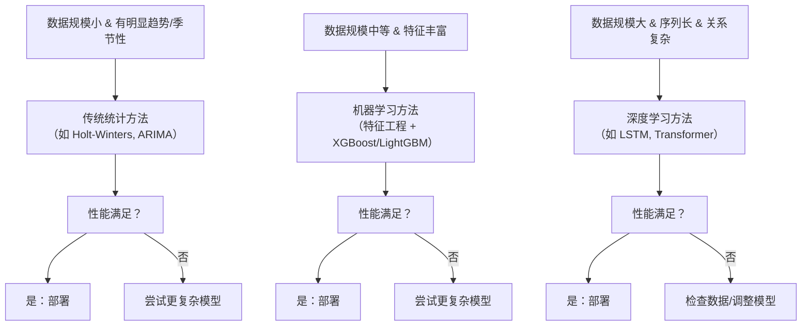

## 时间序列的问题

对于时间序列，如果将滑动窗口预测结果拼接起来，足够长，效果总会看起来很好。但这很有欺骗性。

假设我设计一个预测算法，就把目前窗口内最后一个数直接复制成预测值，就作为预测的下一秒的数据。然后滑动窗口每秒滑动一秒的数据窗口，然后滑动3600次，也就是预测了1个小时的数据。这一小时的数据拼接起来和原数据对比，都会是很好的结果。

把滑动窗口的一步预测（one-step）拼接成很长一段，看起来“很准”，但这并不等价于“长时预测能力强”。因为拼接评估往往隐含了两种“作弊”：

1. 每一步都在用真实历史刷新状态（窗口里包含真实观测），模型从未真正处于“自我滚动（free-run）”状态。
2. 误差不会积累（或积累被真实值不断纠正），而真正的长预测最难的就是误差传播与分布漂移。

另外，可以划分为两种预测：
- 一种是对稳态的预测，那就要在训练的时候数据过滤掉非稳态的情况。这种是不是可以如何解决初始状态问题？
- 一种是对非稳态的预测，那么这样是不是一定需要将最近的输出作为输入参数给模型？因为非稳态是需要

举个例子，对于快速的如简单电路（不考虑RC），比如一个插排的开关，对应着220V交流电和0V的几乎瞬间的变化，但是它的非稳态过程只是对于多数使用者不关心，且对人类的时间尺度来讲很快，所以可以理解为输入和输出是及时反映，但及时这种它也需要过去的输出参数的状态，来预测未来。还有一种例子是对于零初始状态的快速稳态系统。可能不需要过去的输出参数的状态，来预测未来。最负责的情况是，当前的输出会耦合对未来输出造成间接甚至非线性的影响，复杂系统往往是这样。

对于长时预测，无论是稳态还是动态，后期不准完全是可以接受的，因为不知道未来的自变量的变化。所以测试，要分两种情况，一个是后期影响因素稳定和不稳定的情况评估长时预测。

### 1）先把任务定义清楚：哪一种“长预测”？

长预测至少有两种完全不同的定义：

#### A. 闭环条件预测（conditional / closed-loop with observations）

每一步预测前，都能拿到最新观测（比如传感器实时回传），要做的是“下一秒/下一分钟”预测，用来滤波、告警、控制。

这种任务里，“拼接一步预测”是合理的，因为系统每秒都会纠偏。

#### B. 开环自由滚动预测（unconditional / open-loop free-run）

从某个时刻开始，后面一小时完全没有观测，只能靠模型自己滚动把未来生成出来。

这才是“滑动3600次”的真实对应物，而且最容易崩，因为误差会反馈、放大、漂移。

“复制最后一个值（persistence）”在 A 里常常很强，在 B 里遇到任何非稳态/周期/突变就会很差。它之所以在拼接评估里显得强，是因为评估方式更接近 A。

所以：训练与评估必须匹配要的运行方式。否则一定会“看起来很好”。

---

### 2）稳态预测：训练过滤非稳态没错，但“初始状态问题”怎么处理？

稳态可以理解为：在某个时间尺度上统计特性稳定（均值/方差/谱/周期稳定），或在某个工况下系统可近似为定常。

#### 2.1 稳态系统的“状态”从哪来？

即便系统是稳态的，也不意味着“无记忆”。稳态只是统计性质不变；很多稳态系统仍然需要状态（比如周期相位、隐含负载、温度平衡点附近的偏置等）。
#### 2.2 初始状态问题的常见解法（按工程可用性排序）

1. 热启动 / burn-in（最常用）
    预测前先喂一段真实历史（比如过去 N 秒/分钟）让模型内部状态收敛，然后再开始出预测。评估时也要同样做法，并且把 burn-in 段从评分里剔除。

2. 显式状态估计（卡尔曼滤波/状态空间）
    用观测序列估计隐状态 x_t，再用状态转移预测未来。稳态下这非常自然，且“初始状态”就是滤波器估计出来的后验。

3. 学习一个初始化器（learned initializer）
    用一小段历史通过一个网络映射到初始隐状态（RNN/Transformer 的 memory、或状态空间模型的初值）。

4. 直接假设零初值
    只有在“零初始、快速收敛”且确实与应用一致时才靠谱；否则评估会失真（模型在真实运行里很少从零开始）。

结论：稳态不等于不需要初始状态。稳态任务更像“如何快速把状态对齐到当前工况”。

---
### 3）非稳态预测：是否一定要“把最近输出作为输入”？

不一定要“显式把输出喂回去”，但一定要满足一个更本质的条件：

> 未来是否可由某个有限维“状态”决定？如果系统有记忆，必须提供能代表记忆的东西。

#### 3.1 什么时候必须用过去输出（或等价信息）？

- 系统是动态的、有惯性、有积分效应、有滞后（典型物理系统、控制系统）。
- 输入不足以唯一决定输出（部分可观测），输出携带了隐藏状态的信息。
- “当前输出耦合影响未来”本质就是状态依赖、甚至非线性反馈。

这时需要的是NAR / NARX这种结构（自回归 + 外生输入），或者隐状态模型（RNN、Transformer state、SSM）。

#### 3.2 什么时候可以不用过去输出？

- 近似静态映射：y_t \approx f(u_t)，输出几乎瞬时跟随输入（“开关->电压”在忽略细节时确实如此）。
- 或者系统虽然动态，但能直接测到完整状态（极少见），那么“输出历史”不是必须的，因为状态测量已经包含信息。

所以更精确的说法是：

非稳态不等于必须喂回输出；但只要系统有记忆，必须给模型提供足够的状态信息（输出历史是一种最通用的代理）。

---
### 4）长时预测怎么做：训练策略与模型结构的选择

长时预测的难点是“误差累积 + 分布漂移 + 未来外生变量未知”。对应有几条主路线：

#### 4.1 三种多步预测范式（必须区分）

1. 递归式（recursive / iterated）
    训练一步，预测时把预测当输入滚动。优点简单；缺点误差会滚雪球。

2. 直接式（direct / horizon-specific）
    为每个步长 h 训练一个模型：预测 y_{t+h}。优点不积累；缺点成本高、跨步不一致。

3. 多输出式（MIMO / seq2seq）
    一次输出未来一段 [t+1, ..., t+H]。通常是长预测更稳的选择，因为训练目标与推理一致，不靠自回归滚动。

工程上常用建议：
- “开环一小时曲线形状还像样”，优先 MIMO/seq2seq 或 状态空间模型。
- 要“每秒更新、滚动一秒”，递归也行，但评估要按闭环方式做，别冒充开环能力。

#### 4.2 解决“训练时看真值、推理时看预测”的分布差（exposure bias）

如果用递归式或带自回归反馈的结构，训练常用 teacher forcing，会导致推理时一崩就不可逆。常见缓解：
- scheduled sampling（逐渐用预测替代真值作为下一步输入）
- 噪声注入/扰动训练（让模型学会从偏离轨道的状态恢复）
- 直接优化多步损失（训练时就对 free-run 的多步误差负责）

#### 4.3 外生变量未知

长时预测后半段不准的根因往往不是模型，而是“未来输入/扰动未知”。这时正确做法不是硬输出一条线，而是：
- 条件预测：明确假设未来外生量保持、或按某种场景变化（稳定/不稳定两套测试）。
- 联合预测：把外生量也当作要预测的变量一起建模（风险是误差更大，但语义完整）。
- 概率预测/区间预测：给出分位数或置信区间，让“不确定性随步长变大”显式呈现。

---

### 5）怎么测才不被“拼接很好看”骗到
#### 5.1 两种评估协议（对应运行方式）

1. 闭环评估（rolling one-step with refresh）
    每一步都用真实观测更新窗口，只评估一步或短步（1~k）。这适合实时系统。

2. 开环评估（free-run multi-step）
    从时刻 t_0 开始只给历史窗口一次，模型自己生成到 t_0+H。
    评分要按步长分解：看 MAE/RMSE 随 horizon 的曲线，而不是把整段拼一起算一个总分。

#### 5.2 指标也要“按步长分桶”

不要只给一个整体 RMSE。要报告：

- h=1,2,5,10,30,60,\dots 的误差
- 或者“误差-步长曲线下面积”
- 如果有概率输出，用 CRPS、coverage 等

#### 5.3 必须打败的朴素基线

这个“复制最后一个值”就是 persistence baseline。长预测里还要加：

- seasonal naive（复制上一周期同相位值）
- 线性趋势外推（如果序列有趋势）
- 简单 AR/ARIMA/ETS（低成本但强竞争）

只有在开环评估下稳定超过这些基线，长预测才算真的有内容。

---

## 6）“长预测方案模板”

不问具体数据形态时，通用的做法可以这样落地：

1. 明确任务：闭环还是开环；H 多长；外生量未来是否可得。
2. 数据切分按时间滚动（rolling origin），每个起点做一次开环预测到 H。
3. 建模优先用 MIMO/seq2seq 或状态空间（需要可解释和稳定就 SSM；需要强非线性就 seq2seq）。
4. 训练目标包含多步损失，或使用 scheduled sampling 缓解暴露偏差。
5. 输出形式尽量给区间/分位数，尤其当后期外生不确定时。
6. 评估报告按步长误差曲线，并与 persistence/seasonal naive 对比。
7. 额外做两套测试集：
    - 外生稳定（或可控）场景：检验模型动态本身
    - 外生不稳定场景：检验鲁棒性与不确定性校准（区间覆盖率）

---

## 简述

**时间序列算法**是一类专门用于处理**按时间顺序排列的数据点**的算法，其核心目标是发现数据中的内在规律（如趋势性、季节性、周期性），并进行**预测（Forecasting）**、**分类（Classification）** 或**异常检测（Anomaly Detection）**。可以将算法分为三大类：**传统统计方法**、**机器学习方法**和**深度学习方法**。

### 如何选择时序算法？

### 总结

| 类别 | 代表算法 | 优点 | 缺点 | 适用场景 |
| :--- | :--- | :--- | :--- | :--- |
| **传统统计** | ARIMA, Holt-Winters | 可解释性强，理论完善，对小数据效果好 | 难以捕捉复杂非线性关系，需要人工预处理 | 规律性强、数据量不大的场景 |
| **机器学习** | XGBoost, LightGBM | 效果强大，能捕捉非线性，对特征工程友好 | 需要大量特征工程，可解释性较差 | 数据量中等，特征丰富的场景（主流） |
| **深度学习** | LSTM, Transformer | 能自动学习特征，处理超长序列，效果极致 | 需要大量数据，训练成本高，是“黑盒” | 大数据量、复杂模式（如音频、视频序列） |
