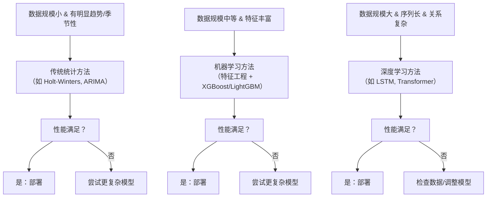

对于时间序列，如果将滑动窗口预测结果拼接起来，足够长，效果总会看起来很好。但这很有欺骗性。

假设我设计一个预测算法，就把目前窗口内最后一个数直接复制成预测值，就作为预测的下一秒的数据。然后滑动窗口每秒滑动一秒的数据窗口，然后滑动3600次，也就是预测了1个小时的数据。这一小时的数据拼接起来和原数据对比，都会是很好的结果。

可以划分为两种预测：
- 一种是对稳态的预测，那就要在训练的时候数据过滤掉非稳态的情况。这种是不是可以如何解决初始状态问题？
- 一种是对非稳态的预测，那么这样是不是一定需要将最近的输出作为输入参数给模型？因为非稳态是需要

举个例子，对于快速的如简单电路（不考虑RC），比如一个插排的开关，对应着220V交流电和0V的几乎瞬间的变化，但是它的非稳态过程只是对于多数使用者不关心，且对人类的时间尺度来讲很快，所以可以理解为输入和输出是及时反映，但及时这种它也需要过去的输出参数的状态，来预测未来。还有一种例子是对于零初始状态的快速稳态系统。可能不需要过去的输出参数的状态，来预测未来。最负责的情况是，当前的输出会耦合对未来输出造成间接甚至非线性的影响，复杂系统往往是这样。

对于长时预测，无论是稳态还是动态，后期不准完全是可以接受的，因为不知道未来的自变量的变化。所以测试，要分两种情况，一个是后期影响因素稳定和不稳定的情况评估长时预测。

## 简述

**时间序列算法**是一类专门用于处理**按时间顺序排列的数据点**的算法，其核心目标是发现数据中的内在规律（如趋势性、季节性、周期性），并进行**预测（Forecasting）**、**分类（Classification）** 或**异常检测（Anomaly Detection）**。可以将算法分为三大类：**传统统计方法**、**机器学习方法**和**深度学习方法**。

### 如何选择时序算法？

### 总结

| 类别 | 代表算法 | 优点 | 缺点 | 适用场景 |
| :--- | :--- | :--- | :--- | :--- |
| **传统统计** | ARIMA, Holt-Winters | 可解释性强，理论完善，对小数据效果好 | 难以捕捉复杂非线性关系，需要人工预处理 | 规律性强、数据量不大的场景 |
| **机器学习** | XGBoost, LightGBM | 效果强大，能捕捉非线性，对特征工程友好 | 需要大量特征工程，可解释性较差 | 数据量中等，特征丰富的场景（主流） |
| **深度学习** | LSTM, Transformer | 能自动学习特征，处理超长序列，效果极致 | 需要大量数据，训练成本高，是“黑盒” | 大数据量、复杂模式（如音频、视频序列） |
